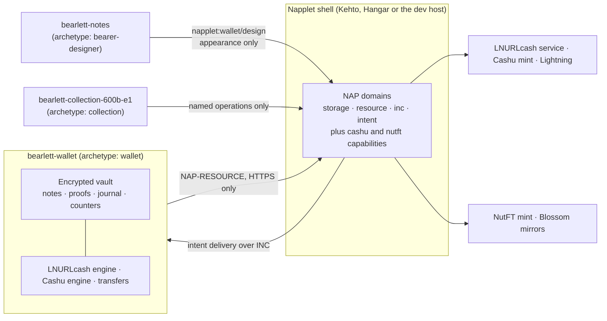

# Bearlett — Bearer Asset Wallet

[](LICENSE)


**Bearer notes and bearer cards, each in its own small app.** Bearlett ships as
sandboxed single-file web apps called _napplets_: **Bearlett Wallet** holds and
spends sats, **Bearlett Notes** designs how they look, and **Bearlett
Collection** holds trading cards you own outright. Each napplet has its own
artifact, manifest and storage, and they talk to each other only through
shell-mediated intents.

Development preview for review, not an audited release. Camera and NFC remain
functions of the original webwallet.

## In plain words

A bearer asset is something you hold yourself: whoever has it, owns it. No
account, no name on a list, nothing to ask permission for.

Bearlett keeps two kinds in one place.

**Money.** LNURLcash notes issued by a service and Cashu ecash issued by a mint.
Receive, split, combine, hand over and pay them, with Lightning as the bridge
between the two worlds. Every note is shown as a banknote with amount, mint,
protocol and status, so a collection reads at a glance.

**Cards.** NutFT trading cards, which are Cashu proofs of amount 1 whose unit is
the collection rather than sats. A card is not a pointer to a picture on someone
else's server: the proof is the card, the mint's signature is the provenance, and
the artwork is fetched by hash and checked before it is shown.

Nothing leaves your device unencrypted. Every operation is written to a journal
before it touches a mint, so an interrupted payment can be reconciled instead of
paid twice.

## Screenshots

| Bearlett Wallet                                                                            | Bearlett Notes                                                         |
| ------------------------------------------------------------------------------------------ | ---------------------------------------------------------------------- |
|  |  |

### Design preview: composable napplets (9 September 2026)

The design brief splits every function into its own napplet and adds a
gaming-asset family for bearer trading cards. The collection napplet below is
built from it and now ships; the rest of the family is still a prototype. The
clickable prototype uses real card art from the 600B Edition One catalogue and
demo balances; nothing in it is spendable.
Design brief: [docs/UI-DESIGN-2026-09-09.md](docs/UI-DESIGN-2026-09-09.md).
Prototype file: [docs/prototype/bearlett-hangar.html](docs/prototype/bearlett-hangar.html).

| Collection with pointer tilt                                       | Card detail with provenance on the back                           |
| ------------------------------------------------------------------ | ----------------------------------------------------------------- |
|  |  |

| Reveal as a scrubbable timeline                                                  | Pay overview                                                      |
| -------------------------------------------------------------------------------- | ----------------------------------------------------------------- |
|  |  |

## Features

### Wallet

- Receive LNURLcash links, `cashuA` and `cashuB` tokens. Review legacy multi-mint
  tokens separately. Cashu receipts rotate proofs into your ownership.
- Display value, protocol, mint and status as banknotes. Split, combine, rotate
  and hand over notes. Revealing a spendable token reserves its value first.
- Fund and pay over Lightning with a fee preview. Transfer sats between
  LNURLcash and Cashu mints, retaining payment, issuance and change journals.
- Use one recovery phrase with separate protocol derivations. Encrypted backups
  contain proofs, counters, quotes, open transfers and designs.

### Notes

- Design notes with uploaded images, colours and text, and push appearance-only
  designs to Wallet through `wallet/design`. A design never contains anything
  spendable.

### Collection

- Hold NutFT cards, grouped into stacks, rarest first, with duplicates, tier and
  type filters and a search.
- Turn a card over for its provenance: asset id, binding, the mint's opinion on
  whether it is still unspent, and the artwork hash that was checked.
- Hand cards over to another wallet's address in this collection. The mint
  re-binds each card, so the handover is atomic and this wallet stops holding it.
- Read the mint's **signed supply ledger** and show issued counts, not just
  printed ones. See below.
- One napplet per edition, with the mint and edition compiled in, so a
  collection never has to ask which one it is.

### Scope

V1 supports **unbound Cashu sats over BOLT11**, LNURLcash, and NutFT cards.
Locked sat tokens, other sat units, on-chain Cashu payments and Cashu hardware
custody are outside this version.

**BOLT12 is not wired.** `@cashu/cashu-ts` 4.10.1 can create BOLT12 quotes, but
neither mint we operate speaks it, so there is nothing to point it at yet. The
reasoning is recorded in
[docs/INFRASTRUCTURE-TODO-2026-09-10.md](docs/INFRASTRUCTURE-TODO-2026-09-10.md),
section E.

## Quick start

Node.js 24 and npm:

```sh
npm ci
npm run build:napplet   # Wallet -> dist-napplet/index.html
npm run build:notes     # Notes  -> dist-notes/index.html
npm run preview:napplet # Wallet: http://127.0.0.1:4186/wallet  Notes: http://127.0.0.1:4186/notes
```

A collection builds once per edition, and the mode names which one. The mint
address is compiled in, so it has to be given:

```sh
BEARLETT_MINT=https://tcg.example npm run build:collection -- --mode 600b-e1
# -> dist-collection-600b-e1/index.html   (one self-contained file, ~337 kB)
```

Editions are `600b-e1` and `600b-g`. There is no development host for a
collection yet: it needs a shell that grants the `nutft` capability, which the
dev host does not.

Use separate tabs for Wallet and Notes. The development host injects the
official `@napplet/shim`, uses an in-memory test mint and volatile session
storage. Its notes have no monetary value and it is not a production host.

Verify before you change anything that touches funds:

```sh
npm test                      # unit and fault tests (509 passing, 1 skipped, 10 Sep 2026)
npm run tsc
npm run format:check
npm run test:napplet:browser  # Playwright, needs: npx playwright install chromium
npm run test:regtest          # optional, real mints on Bitcoin regtest
```

---

## Technical part

### Architecture



- **One napplet, one purpose.** Each is a separate artifact with its own
  manifest (`kind 35129`) and storage scope. Notes can push a design to Wallet in
  the background; it never embeds or switches to the wallet.
- **Intents, not links.** Napplets never address each other directly. A caller
  names an archetype and a convention; the shell resolves the user's default
  handler and delivers the payload. `ok` and `handled` confirm dispatch, never
  success.
- **Sandbox.** Each napplet runs in an iframe with `sandbox="allow-scripts"` and
  a CSP of `default-src 'none'; script-src 'unsafe-inline'; style-src
'unsafe-inline'; img-src data: blob:; connect-src 'none'; font-src 'none'`.
  Everything ships inline in one file; network goes only through NAP-RESOURCE
  over HTTPS.
- **A napplet names operations, never URLs.** The collection reaches its mint
  through a fixed map of named operations, and an allow-listed Blossom mirror
  through the byte channel. Anything else is refused before it leaves the
  napplet.
- **No signer in the collection.** The Nostr signer is sealed shut at start-up
  rather than left reachable, so a card napplet cannot be talked into signing
  anything. See `src/napplet/collection/no-signer.ts`.

### Napplet contracts

| Role              | Convention                     | Payload                    | Effect                            |
| ----------------- | ------------------------------ | -------------------------- | --------------------------------- |
| `wallet`          | `napplet:wallet/open`          | absent or `{}`             | Show wallet                       |
| `wallet`          | `napplet:wallet/receive`       | `{note: string}`           | Stage receive review              |
| `wallet`          | `napplet:wallet/pay`           | `{invoice: string}`        | Stage payment review              |
| `wallet`          | `napplet:wallet/design`        | `NoteDesignMessage`        | Stage design import review        |
| `bearer-designer` | `napplet:bearer-designer/open` | absent, `{}` or `{design}` | Open Notes with an optional draft |
| `collection`      | `napplet:collection/open`      | absent or `{}`             | Show one edition's cards          |

These are local, unregistered contract proposals following the NAP-INTENT
convention model; the official archetype registry has no wallet role yet. Wallet
requires `storage`, `resource` and `inc`; Notes requires `storage` and `inc`;
Collection requires `storage`, `resource` and `inc` plus the Bearlett `nutft`
capability. Cashu additionally needs the optional Bearlett `cashu` host
capability with its storage-scope writer lease; see
[docs/KEHTO.md](docs/KEHTO.md). Full contract details and the planned
twelve-napplet catalogue: [docs/NAPPLETS.md](docs/NAPPLETS.md),
[docs/UI-DESIGN-2026-09-09.md](docs/UI-DESIGN-2026-09-09.md).

### Storage and recovery model

- Seed material, monotonic counters, assets and Cashu operations live in one
  AES-GCM encrypted snapshot. Host writes must be acknowledged durably before an
  old note can be burned.
- One BIP39 phrase supplies separate Cashu (NUT-13) and LNURLcash (LUD-25)
  derivations. Backups exist in the original `lnurlwallet-backup` format and in
  the full napplet format with artwork, pending outputs and history.
- The journal records inputs, prepared outputs, blinding material, quote and
  keyset before dispatch. Ambiguous outcomes stay reserved for manual checks;
  there is no automatic mutation retry and a timeout never authorises a second
  payment.
- One writer per storage scope. NAP-STORAGE has no cross-window transactions, so
  hosts reuse one wallet window per scope and device changes are explicit.

### Cards, and counting them in public

A collection is valued on how scarce it is, and scarcity is a claim about the
mint's books. Blind signatures hide **who** holds a card. They were never meant
to hide **how many exist**.

So the mint signs its books as chained Nostr events, kind `7610`, with the same
catalogue key the wallet already trusts, each snapshot naming the one before it.
The napplet verifies the chain before it shows a number:

- every event hashes to its own id and is signed by the catalogue issuer;
- it names this collection, census and catalogue;
- sequence numbers run consecutively, each event naming its predecessor;
- counts cover exactly the printed cards, none ever grows, packs sold never
  shrinks;
- the books balance: `printed − remaining = sold × issued per pack`.

The last snapshot seen is remembered, with its figures, so a mint that quietly
rewrites history is caught on the next open rather than believed. The chain is
served a page at a time, so reading it takes one request normally and two after
a long absence.

The figures are cards **issued**, not cards allocated: a mint that takes
committed purchases reserves a pack before anyone claims it and puts it back if
nobody does, and a reservation is not an issue. A chain that fails any check
shows its reason and no counts, but the cards stay on screen: they are proofs,
the ledger is only a claim about the mint.

Verifier: `src/napplet/collection/supply.ts`. Event format and the mint side:
`docs/nutft-supply-ledger.md` in the
[600B Timelock TCG](https://github.com/BIMbeamFLX/600BillionTimelockTCG)
repository.

### Protocols

| Protocol                                                                        | Status in Bearlett                                                                                                       |
| ------------------------------------------------------------------------------- | ------------------------------------------------------------------------------------------------------------------------ |
| LNURLcash ([LUD-25](https://github.com/lnurl/luds/blob/lnurlcash/25.md), draft) | Receive, rotate, split, merge, hand over, mint, melt; LUD-25 hash commitment via the LUD-12 comment                      |
| Cashu ([NUTs](https://github.com/cashubtc/nuts)) via `@cashu/cashu-ts` 4.10.1   | NUT-07 and NUT-09 mandatory, NUT-08 for melts, NUT-13 restore, NUT-20 quote keys; `sat` unit only                        |
| NutFT (NUT-31 draft, trading-card profile)                                      | Hold, inspect and hand over cards; P2BK-bound proofs of amount 1, DLEQ required, signed catalogue and supply ledger verified |
| Blossom                                                                         | Card artwork fetched by SHA-256 from allow-listed mirrors and re-hashed before it is displayed                            |
| Lightning BOLT11                                                                | Pay fixed-amount invoices and Lightning addresses; fund via mint quotes                                                  |
| Lightning BOLT12                                                                | Available in cashu-ts 4.10.1; **not wired**, and neither mint we operate offers it                                      |

### Repository layout

```
src/                            original webwallet (kept for compatibility and regression tests)
src/napplet/                    Wallet and Notes napplets (SolidJS): vault, engines, intents, UI
src/napplet/collection/         Collection napplet: cards, faces, editions, supply verifier
src/napplet/collection/vendor/  the NutFT card library, vendored byte-identical (MIT)
src/host/                       host-side shims and the cashu and nutft service contracts
napplet/                        napplet HTML entry points
scripts/                        napplet dev host, regtest helpers
tests/                          unit, fault and browser tests; tests/integration for regtest
docs/                           architecture, audits, protocol notes, design brief, screenshots, prototype
```

The vendored card library is kept **byte-identical** to its upstream on purpose:
re-syncing is then a plain copy, and its SHA-256 says whether it has drifted.
The hash is asserted in `bootstrap.test.ts`, so drift fails the suite instead of
being discovered later. Provenance and licence:
`src/napplet/collection/vendor/README.md`.

### Documentation

| Document                                                                               | Content                                                                        |
| -------------------------------------------------------------------------------------- | ------------------------------------------------------------------------------ |
| [docs/BEARLETT.md](docs/BEARLETT.md)                                                   | Implementation and recovery details, read before touching funds                |
| [docs/NAPPLETS.md](docs/NAPPLETS.md)                                                   | Build, preview, contracts, verification of every napplet                       |
| [docs/KEHTO.md](docs/KEHTO.md)                                                         | Kehto shell integration and the `cashu` capability                             |
| [docs/VALIDATION.md](docs/VALIDATION.md)                                               | Validation record                                                              |
| [docs/HOW-TO-WALLET-OWNERSHIP-PROOFS.md](docs/HOW-TO-WALLET-OWNERSHIP-PROOFS.md)       | Wallet-side ownership proofs for LNURLcash                                     |
| [docs/SECURITY-FIXES-2026-09-09.md](docs/SECURITY-FIXES-2026-09-09.md)                 | Security fixes and audit handover                                              |
| [docs/ARCHITECTURE-2026-09-09.md](docs/ARCHITECTURE-2026-09-09.md)                     | Architecture decision after the spec check                                     |
| [docs/FEASIBILITY-2026-09-09.md](docs/FEASIBILITY-2026-09-09.md)                       | Feasibility report                                                             |
| [docs/INFRASTRUCTURE-2026-09-09.md](docs/INFRASTRUCTURE-2026-09-09.md)                 | Test infrastructure                                                            |
| [docs/BLOSSOM-BEARER-STORAGE-2026-09-09.md](docs/BLOSSOM-BEARER-STORAGE-2026-09-09.md) | Encrypted bearer storage on Blossom                                            |
| [docs/NAPPELIN-INTEGRATION-2026-09-09.md](docs/NAPPELIN-INTEGRATION-2026-09-09.md)     | Shared identity and backup path with Nappelin                                  |
| [docs/TCG-WALLET-2026-09-09.md](docs/TCG-WALLET-2026-09-09.md)                         | Existing trading-card wallet inventory                                         |
| [docs/UI-DESIGN-2026-09-09.md](docs/UI-DESIGN-2026-09-09.md)                           | UI design brief: composable napplets, assets, pay, animation stack             |
| [docs/NUTFT-POKEMON-POC-2026-09-10.md](docs/NUTFT-POKEMON-POC-2026-09-10.md)           | Review of a collaborator NutFT card mint and what to adopt                     |
| [docs/NUTFT-LIBRARY-WIRING-2026-09-10.md](docs/NUTFT-LIBRARY-WIRING-2026-09-10.md)     | What the NutFT card library needs from a napplet host                          |
| [docs/HOW-TO-MINT-ASSETS.md](docs/HOW-TO-MINT-ASSETS.md)                               | What it takes to mint your own bearer game assets with the NutFT mint          |
| [docs/INFRASTRUCTURE-TODO-2026-09-10.md](docs/INFRASTRUCTURE-TODO-2026-09-10.md)       | What still has to be built as infrastructure, and the two mints we run         |
| [docs/LINK-PROPOSALS.md](docs/LINK-PROPOSALS.md)                                       | Proposed link formats between napplets                                         |
| [docs/SOURCES-2026-09-09.md](docs/SOURCES-2026-09-09.md)                               | Pinned specification and dependency sources                                    |
| [docs/UPSTREAM-LNURLWALLET.md](docs/UPSTREAM-LNURLWALLET.md)                           | Original LNURLwallet documentation                                             |
| [tests/integration/README.md](tests/integration/README.md)                             | Regtest environment with LNURLmint, Nutshell and two LND nodes                 |

### Contributing

- Branches: `main` is always stable; work happens on `feature/*`, `fix/*` and
  `docs/*` and lands through a pull request with at least one review.
- Commits follow Conventional Commits: `feat`, `fix`, `chore`, `test`, `docs`,
  `refactor`, `perf`.
- Run `npm test`, `npm run tsc` and `npm run format:check` before every commit.
- One pull request, one concern. Describe why, not only what.
- Security findings: open an issue marked _security_; the current handover for
  external audit is [docs/SECURITY-FIXES-2026-09-09.md](docs/SECURITY-FIXES-2026-09-09.md).

## Origins and license

Based on [dni's LNURLwallet](https://github.com/lnurlcash/lnurl-wallet) and our
independent napplet work. Original history is retained; imported baseline:
`e0fbf00453ea0736c8ec484f8bcea002b1229b0c`. Original documentation is preserved
in [docs/UPSTREAM-LNURLWALLET.md](docs/UPSTREAM-LNURLWALLET.md). The original
webwallet source remains for compatibility and regression testing; Bearlett's
installable products are the napplets.

The NutFT card library in `src/napplet/collection/vendor/` is MIT, copyright the
600Billion contributors, vendored unchanged from the
[600B Timelock TCG](https://github.com/BIMbeamFLX/600BillionTimelockTCG)
repository.

Card artwork in the design prototype belongs to the 600B Edition One catalogue
and is used here for design review only.

[MIT license](LICENSE). Protocols: [LUD-25](https://github.com/lnurl/luds/blob/lnurlcash/25.md),
[Cashu NUTs](https://github.com/cashubtc/nuts) and the
[NutFT draft](https://github.com/brenorb/NutFT). Cashu uses `@cashu/cashu-ts` **4.10.1**.
