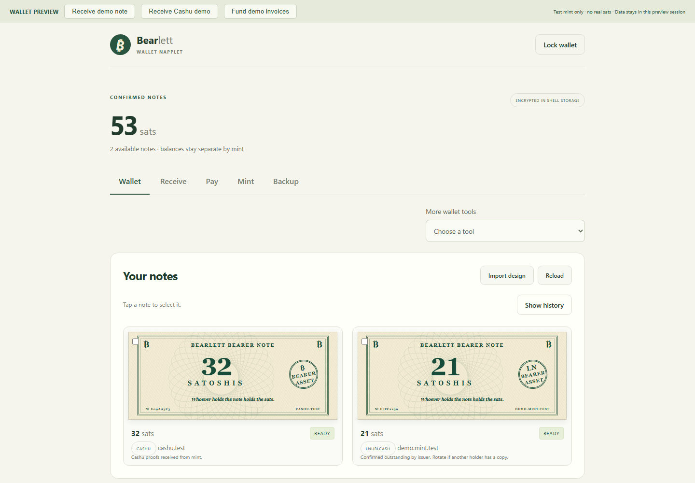
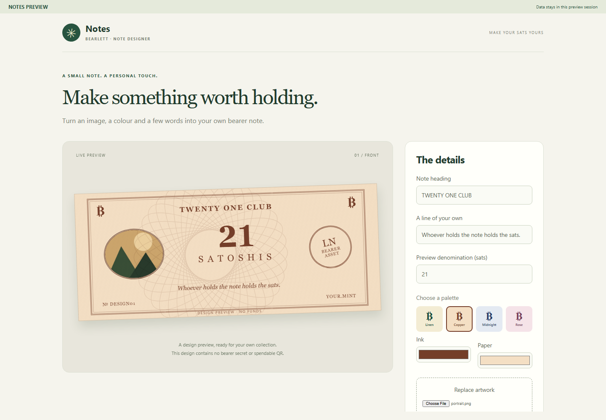
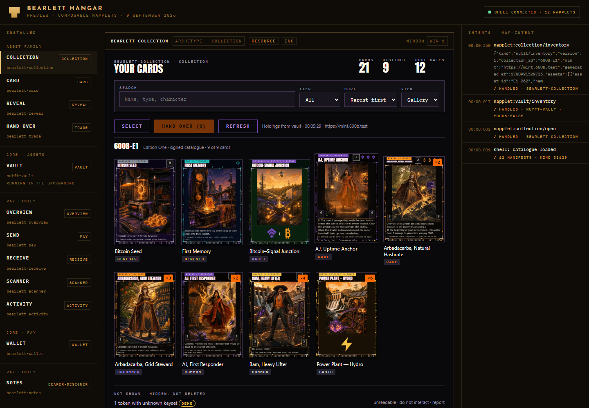
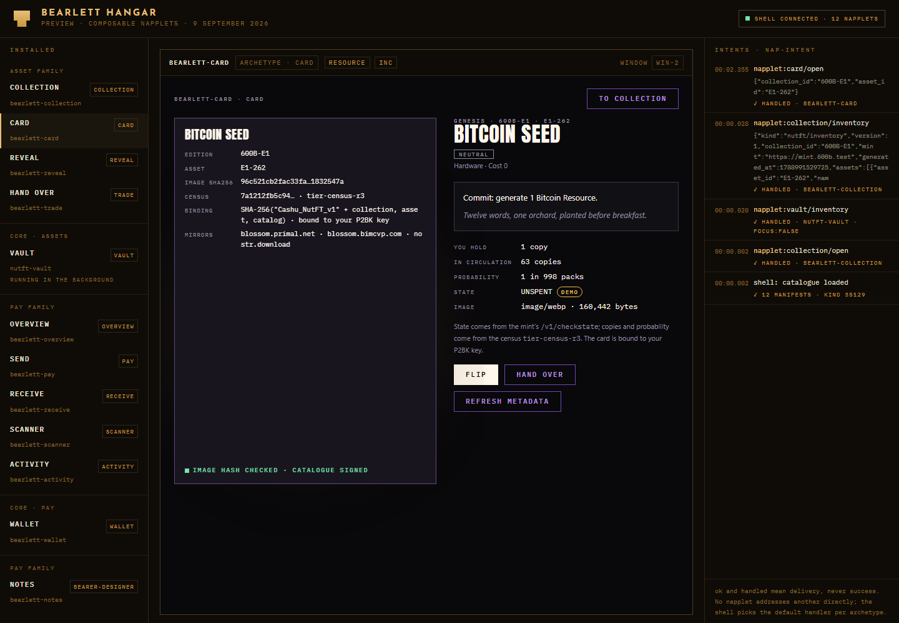
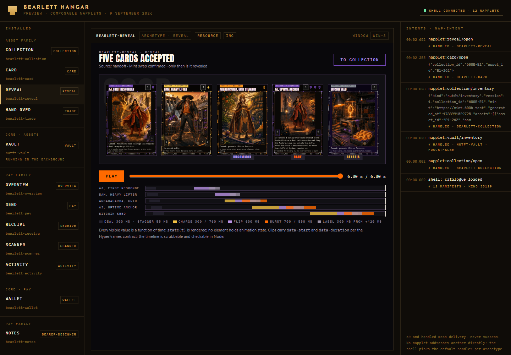
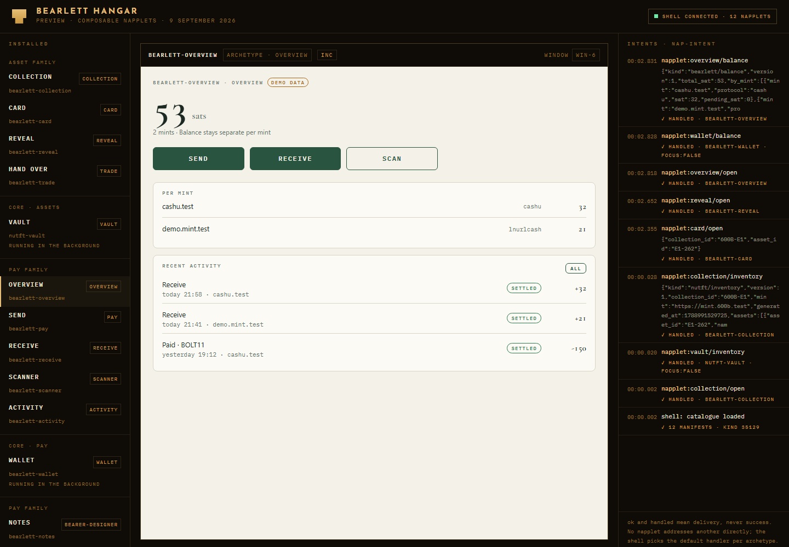
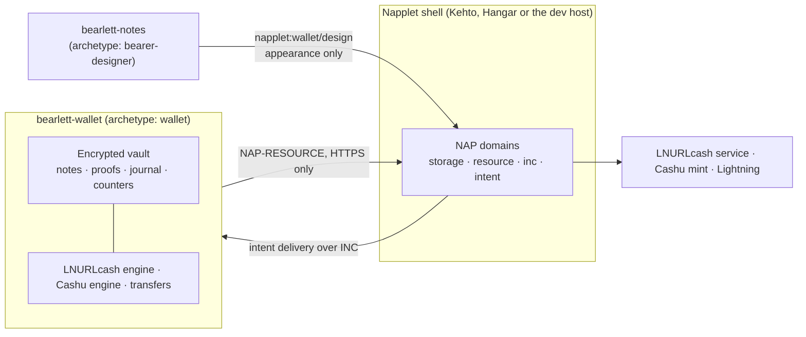

# Bearlett — Bearer Asset Wallet

[](LICENSE)


**LNURLcash and Cashu bearer notes, together in one wallet.** Bearlett ships as
small sandboxed web apps called _napplets_: **Bearlett Wallet** holds and spends
sats, **Bearlett Notes** designs how they look. Each napplet has its own artifact,
manifest and storage, and they talk to each other only through shell-mediated
intents.

Development preview for review, not an audited release. Camera and NFC remain
functions of the original webwallet.

## In plain words

A bearer note is digital cash you hold yourself: whoever has the note has the sats.
Bearlett keeps two kinds of bearer notes in one place, LNURLcash notes issued by a
service and Cashu ecash issued by a mint, and lets you receive, split, combine,
hand over and pay them, with Lightning as the bridge between the two worlds.

Every note is shown as a banknote with amount, mint, protocol and status, so a
collection reads at a glance. Notes you design in Bearlett Notes carry your own
image, colours and words; the design never contains anything spendable.

Nothing leaves your device unencrypted. Every operation is written to a journal
before it touches a mint, so an interrupted payment can be reconciled instead of
paid twice.

## Screenshots

| Bearlett Wallet                                                                            | Bearlett Notes                                                         |
| ------------------------------------------------------------------------------------------ | ---------------------------------------------------------------------- |
|  |  |

### Design preview: composable napplets (9 September 2026)

The next step splits every function into its own napplet and adds a gaming-asset
family for bearer trading cards. The clickable prototype uses real card art from
the 600B Edition One catalogue and demo balances; nothing in it is spendable.
Design brief: [docs/UI-DESIGN-2026-09-09.md](docs/UI-DESIGN-2026-09-09.md) (German).
Prototype file: [docs/prototype/bearlett-hangar.html](docs/prototype/bearlett-hangar.html).

| Collection with pointer tilt                                       | Card detail with provenance on the back                           |
| ------------------------------------------------------------------ | ----------------------------------------------------------------- |
|  |  |

| Reveal as a scrubbable timeline                                                  | Pay overview                                                      |
| -------------------------------------------------------------------------------- | ----------------------------------------------------------------- |
|  |  |

## Features

- Receive LNURLcash links, `cashuA` and `cashuB` tokens. Review legacy multi-mint
  tokens separately. Cashu receipts rotate proofs into your ownership.
- Display value, protocol, mint and status as banknotes. Split, combine, rotate
  and hand over notes. Revealing a spendable token reserves its value first.
- Fund and pay over Lightning with a fee preview. Transfer sats between
  LNURLcash and Cashu mints, retaining payment, issuance and change journals.
- Use one recovery phrase with separate protocol derivations. Encrypted backups
  contain proofs, counters, quotes, open transfers and designs.
- Design notes with uploaded images, colours and text in **Bearlett Notes**;
  push appearance-only designs to Wallet through `wallet/design`.

### Scope

V1 supports **unbound Cashu sats over BOLT11** and LNURLcash. Locked tokens,
other units, BOLT12, on-chain Cashu payments and Cashu hardware custody are
outside this version. The design work of 9 September 2026 extends the target
with bound gaming assets and BOLT12; that extension is documented, not shipped.

## Quick start

Node.js 24 and npm:

```sh
npm ci
npm run build:napplet   # Wallet  -> dist-napplet/index.html
npm run build:notes     # Notes   -> dist-notes/index.html
npm run preview:napplet # Wallet: http://127.0.0.1:4186/wallet  Notes: http://127.0.0.1:4186/notes
```

Use separate tabs. The development host injects the official `@napplet/shim`,
uses an in-memory test mint and volatile session storage. Its notes have no
monetary value and it is not a production host.

Verify before you change anything that touches funds:

```sh
npm test                      # unit and fault tests (391 passing, 1 skipped, 9 Sep 2026)
npm run tsc
npm run format:check
npm run test:napplet:browser  # Playwright, needs: npx playwright install chromium
npm run test:regtest          # optional, real mints on Bitcoin regtest
```

---

## Technical part

### Architecture



- **One napplet, one purpose.** Wallet and Notes are separate artifacts with
  separate manifests (`kind 35129`) and storage scopes. Notes can push a design
  to Wallet in the background; it never embeds or switches to the wallet.
- **Intents, not links.** Napplets never address each other directly. A caller
  names an archetype and a convention; the shell resolves the user's default
  handler and delivers the payload. `ok` and `handled` confirm dispatch, never
  success.
- **Sandbox.** Each napplet runs in an iframe with `sandbox="allow-scripts"` and
  a CSP of `default-src 'none'; script-src 'unsafe-inline'; style-src
'unsafe-inline'; img-src data: blob:; connect-src 'none'; font-src 'none'`.
  Everything ships inline in one file; network goes only through NAP-RESOURCE
  over HTTPS.

### Napplet contracts

| Role              | Convention                     | Payload                    | Effect                            |
| ----------------- | ------------------------------ | -------------------------- | --------------------------------- |
| `wallet`          | `napplet:wallet/open`          | absent or `{}`             | Show wallet                       |
| `wallet`          | `napplet:wallet/receive`       | `{note: string}`           | Stage receive review              |
| `wallet`          | `napplet:wallet/pay`           | `{invoice: string}`        | Stage payment review              |
| `wallet`          | `napplet:wallet/design`        | `NoteDesignMessage`        | Stage design import review        |
| `bearer-designer` | `napplet:bearer-designer/open` | absent, `{}` or `{design}` | Open Notes with an optional draft |

These are local, unregistered contract proposals following the NAP-INTENT
convention model; the official archetype registry has no wallet role yet. Wallet
requires `storage`, `resource` and `inc`; Notes requires `storage` and `inc`.
Cashu additionally needs the optional Bearlett `cashu` host capability with its
storage-scope writer lease; see [docs/KEHTO.md](docs/KEHTO.md). Full contract
details and the planned twelve-napplet catalogue with intents and archetypes:
[docs/NAPPLETS.md](docs/NAPPLETS.md), [docs/UI-DESIGN-2026-09-09.md](docs/UI-DESIGN-2026-09-09.md).

### Storage and recovery model

- Seed material, monotonic counters, assets and Cashu operations live in one
  AES-GCM encrypted snapshot. Host writes must be acknowledged durably before an
  old note can be burned.
- One BIP39 phrase supplies separate Cashu (NUT-13) and LNURLcash (LUD-25)
  derivations. Backups exist in the original `lnurlwallet-backup` format and in
  the full napplet format with artwork, pending outputs and history.
- The journal records inputs, prepared outputs, blinding material, quote and
  keyset before dispatch. Ambiguous outcomes stay reserved for manual checks;
  there is no automatic mutation retry and a timeout never authorises a second
  payment.
- One writer per storage scope. NAP-STORAGE has no cross-window transactions, so
  hosts reuse one wallet window per scope and device changes are explicit.

### Protocols

| Protocol                                                                        | Status in Bearlett                                                                                                       |
| ------------------------------------------------------------------------------- | ------------------------------------------------------------------------------------------------------------------------ |
| LNURLcash ([LUD-25](https://github.com/lnurl/luds/blob/lnurlcash/25.md), draft) | Receive, rotate, split, merge, hand over, mint, melt; LUD-25 hash commitment via the LUD-12 comment                      |
| Cashu ([NUTs](https://github.com/cashubtc/nuts)) via `@cashu/cashu-ts` 4.10.1   | NUT-07 and NUT-09 mandatory, NUT-08 for melts, NUT-13 restore, NUT-20 quote keys; `sat` unit only                        |
| Lightning BOLT11                                                                | Pay fixed-amount invoices and Lightning addresses; fund via mint quotes                                                  |
| Lightning BOLT12                                                                | Available in cashu-ts 4.10.1 (`createMintQuoteBolt12`, `createMeltQuoteBolt12`); not wired yet, designed in the UI brief |

### Repository layout

```
src/                 original webwallet (kept for compatibility and regression tests)
src/napplet/         Wallet and Notes napplets (SolidJS): vault, engines, intents, UI
src/host/            host-side storage shim for the dev host
scripts/             napplet dev host, regtest helpers
tests/               unit, fault and browser tests; tests/integration for regtest
docs/                architecture, audits, protocol notes, design brief, screenshots, prototype
```

### Documentation

| Document                                                                               | Content                                                                     |
| -------------------------------------------------------------------------------------- | --------------------------------------------------------------------------- |
| [docs/BEARLETT.md](docs/BEARLETT.md)                                                   | Implementation and recovery details, read before touching funds             |
| [docs/NAPPLETS.md](docs/NAPPLETS.md)                                                   | Build, preview, contracts, verification of both napplets                    |
| [docs/KEHTO.md](docs/KEHTO.md)                                                         | Kehto shell integration and the `cashu` capability                          |
| [docs/VALIDATION.md](docs/VALIDATION.md)                                               | Validation record                                                           |
| [docs/HOW-TO-WALLET-OWNERSHIP-PROOFS.md](docs/HOW-TO-WALLET-OWNERSHIP-PROOFS.md)       | Wallet-side ownership proofs for LNURLcash                                  |
| [docs/SECURITY-FIXES-2026-09-09.md](docs/SECURITY-FIXES-2026-09-09.md)                 | Security fixes and audit handover (German)                                  |
| [docs/ARCHITECTURE-2026-09-09.md](docs/ARCHITECTURE-2026-09-09.md)                     | Architecture decision after the spec check (German)                         |
| [docs/FEASIBILITY-2026-09-09.md](docs/FEASIBILITY-2026-09-09.md)                       | Feasibility report (German)                                                 |
| [docs/INFRASTRUCTURE-2026-09-09.md](docs/INFRASTRUCTURE-2026-09-09.md)                 | Test infrastructure (German)                                                |
| [docs/BLOSSOM-BEARER-STORAGE-2026-09-09.md](docs/BLOSSOM-BEARER-STORAGE-2026-09-09.md) | Encrypted bearer storage on Blossom (German)                                |
| [docs/NAPPELIN-INTEGRATION-2026-09-09.md](docs/NAPPELIN-INTEGRATION-2026-09-09.md)     | Shared identity and backup path with Nappelin (German)                      |
| [docs/TCG-WALLET-2026-09-09.md](docs/TCG-WALLET-2026-09-09.md)                         | Existing trading-card wallet inventory (German)                             |
| [docs/UI-DESIGN-2026-09-09.md](docs/UI-DESIGN-2026-09-09.md)                           | UI design brief: composable napplets, assets, pay, animation stack (German) |
| [docs/SOURCES-2026-09-09.md](docs/SOURCES-2026-09-09.md)                               | Pinned specification and dependency sources (German)                        |
| [docs/UPSTREAM-LNURLWALLET.md](docs/UPSTREAM-LNURLWALLET.md)                           | Original LNURLwallet documentation                                          |
| [tests/integration/README.md](tests/integration/README.md)                             | Regtest environment with LNURLmint, Nutshell and two LND nodes              |

### Contributing

- Branches: `main` is always stable; work happens on `feature/*` and `fix/*`
  and lands through a pull request with at least one review.
- Commits follow Conventional Commits: `feat`, `fix`, `chore`, `test`, `docs`,
  `refactor`, `perf`.
- Run `npm test`, `npm run tsc` and `npm run format:check` before every commit.
- One pull request, one concern. Describe why, not only what.
- Security findings: open an issue marked _security_; the current handover for
  external audit is [docs/SECURITY-FIXES-2026-09-09.md](docs/SECURITY-FIXES-2026-09-09.md).

## Origins and license

Based on [dni's LNURLwallet](https://github.com/lnurlcash/lnurl-wallet) and our
independent Wallet/Notes napplet work. Original history is retained; imported
baseline: `e0fbf00453ea0736c8ec484f8bcea002b1229b0c`. Original documentation is
preserved in [docs/UPSTREAM-LNURLWALLET.md](docs/UPSTREAM-LNURLWALLET.md).
The original webwallet source remains for compatibility and regression testing;
Bearlett's installable products are the two napplets.

Card artwork in the design prototype belongs to the 600B Edition One catalogue
and is used here for design review only.

[MIT license](LICENSE). Protocols: [LUD-25](https://github.com/lnurl/luds/blob/lnurlcash/25.md)
and [Cashu NUTs](https://github.com/cashubtc/nuts). Cashu uses `@cashu/cashu-ts` **4.10.1**.
