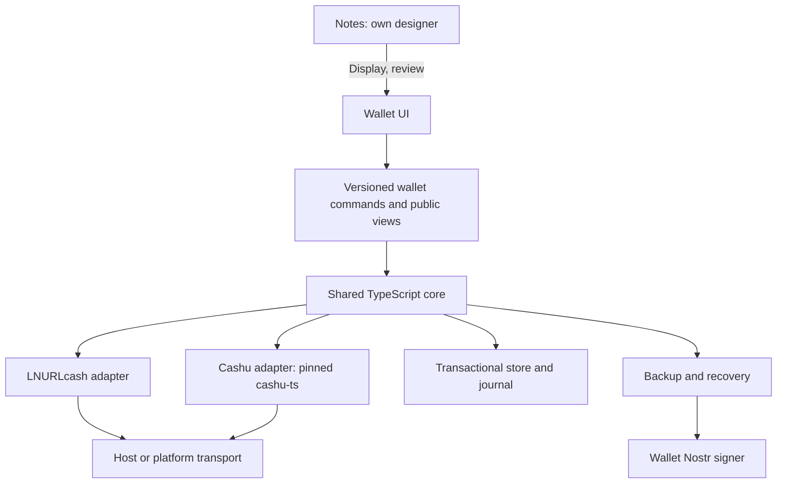

# Bearlett: architecture decision after the spec check

Status: Recommendation, not a rewrite. Based on
[feasibility report](FEASIBILITY-2026-09-09.md) and
[checked sources](SOURCES-2026-09-09.md). Confirmed on 9 September 2026:
**V1 has one actively writing device with an explicit device handover.**

Later inventory correction: the TCG wallet already contains a
NutFT wallet with encrypted Blossom/Nostr storage. Check the existing
adapter and reuse it; see [TCG wallet comparison](TCG-WALLET-2026-09-09.md).
**Granola and the XMR/USDT swaps planned on top of it are expressly V2.**

## Shared core and trust boundaries

`Bearlett`, `Wallet`, `CashuEngine`, `Transfers`, Vault and the protocol helpers
are the starting point. Do not write three new wallets. First fix the
reproduced faults. Then extract the core from the `napplet` folder.
`window`, Solid, global offline settings and
`import.meta.env.MODE` must not drive core logic. They belong in
adapters. `serviceTransport.ts` is still such a platform coupling today.



The diagram describes source-code reuse. **Where it runs and
whom you trust differ by platform:**

| Surface           | Core / storage                                                                                                                                                 | Real boundary                                                                                                                                                                              |
| ----------------- | -------------------------------------------------------------------------------------------------------------------------------------------------------------- | ------------------------------------------------------------------------------------------------------------------------------------------------------------------------------------------ |
| Napplet Wallet    | Trusted host runs the shared core; transactional host store. The napplet receives views, reviews and explicitly confirmed handover results.                    | Fits the NIP-5D direction: keys/signing/vault in the host. Requires a new wallet capability labelled as Bearlett-specific. The existing Cashu POST capability alone is not enough.         |
| Web/PWA           | Same core in the first-party web context, optional worker; encrypted IndexedDB records and atomic transactions.                                                | Browser/origin/update trust remains. A worker eases serialisation. It is not a hardware security boundary against compromised first-party code.                                            |
| Android/Capacitor | Same TS core in the bundled first-party app; Kotlin adapters for database, key wrapping, signer and lifecycle.                                                 | JS handles wallet secrets in the unlocked state. Keystore protects the wrapping key. It does not automatically protect the running JS process.                                             |

The current napplet vault may remain as a test/migration source.
It processes seed and proofs itself. It is therefore not to be advertised as a
strictly host-custodied wallet. A version aligned with the standard needs the host
service. That service should grant wallet commands instead of arbitrary
URLs/POST bodies: prepare, confirm, reconcile state, export backup. The host
binds every job to artifact, wallet ID, user grant and revision.
A design intent never receives a spend grant.

### Storage and transaction contract

One wallet writer serialises **all** protocols, transfers, annotations,
imports and backups. UI `busy`, two separate class mutexes or a
service map per shell tab are not sufficient for this.

A store commit must persist inputs, prepared outputs, counters, operation,
transfer references and new ownership states atomically, or in demonstrably
resumable journal steps. A persistent operation
contains at least ID, type, phase, wallet/writer revision, mint/keyset/unit,
inputs, exact outputs and blinding data, quote, invoice hash, fee limit and
NUT-20 key when applicable. Never put secrets in diagnostic logs.

Web: IndexedDB transaction with revision and one local exclusive writer
(Web Locks where available; otherwise refuse competing writers).
Android: SQLite transactions with checked commit/sync behaviour behind a
Kotlin adapter; encrypted records or separately licence-checked
database encryption. NAP-STORAGE remains for non-critical napplet settings.
Kehto's `ok:false` fault must be corrected end-to-end first.

The Bitcoin/Lightning/mint side and the local store cannot form a shared
ACID transaction. The bridge therefore remains a persisted flow with
resume. Persist before every possible spend of value. After abort, check against
the existing operation. Never derive a new payment from a timeout.
Success only after secured destination assets **and** booked/reconciled change.

## Keys and recovery

### Recommendation for V1

Keep the existing BIP39 phrase for LNURLcash and Cashu. The two
protocols keep their documented derivations: LNURLcash `m/139'` with
service derivation; Cashu per NUT-13 including keyset versions; NUT-20
separately `m/129373'/20'/0'/0'/{counter}`. The existing storage-root context is
a project-internal derivation. It is not a generic wallet standard.

Additionally create a **random Nostr key used only for Bearlett**
in the trusted host or external signer. No derivation from
npub. No use of the social key. NIP-07 only provides APIs. It does not
produce a standardised wallet key. The onboarding flow must explicitly support
creation, selection of the correct account, and backup.

| Variant                                                    | Assessment                                                                                                                                                                                                                                                     |
| ---------------------------------------------------------- | -------------------------------------------------------------------------------------------------------------------------------------------------------------------------------------------------------------------------------------------------------------- |
| One master mnemonic for both protocols and Nostr           | Technically possible. A new documented derivation and independent vectors are required. NIP-06 describes `m/44'/1237'/account'/0/0`. It is currently explicitly `unrecommended`. Do not sell it as an unproblematic standard. Seed loss/theft affects every domain. |
| Existing wallet phrase plus a dedicated random Nostr key   | Recommendation: no new key construction, separation from the social key, and independent key rotation. The user needs both recovery components.                                                                                                                |
| External signer with its own wallet account                | A good alternative when signing **and NIP-44 encrypt/decrypt** are available and its backup is mastered. A signer-only path without decryption is not enough.                                                                                                  |

NUT-27 already offers a deterministic Nostr derivation for **mint-list
backups**. It is suitable for exactly that interoperable format. It is not
automatically the wallet Nostr identity or a complete vault backup.

Web: Create keys only in the trusted context, with CSPRNG and a
proven library. Store the local key encrypted. Explicitly test password KDF and
unlock. No plaintext keys in localStorage. The current
PBKDF2/AES-GCM code is existing machinery. It is not a completed security review.

Android: Keystore AES wrapping key with authentication, where device/OS
support it. Check Security Level/StrongBox availability. Do not assume it.
Nostr/secp256k1 signing is not a generally guaranteed Keystore function.
With an external signer, its private Nostr key stays there. The wallet core
still receives decrypted wallet data. After lock, app background and
process restart, require a new unlock and journal check.

### Signer adapter and proof of control

- Web: NIP-07 with feature check, alternatively NIP-46. Paja already has these two
  backends. No `window.nostr` in the napplet.
- Android: NIP-55 via explicitly bound package intents/ActivityResult and,
  after granted permission, ContentResolver; Amber is one such signer. NIP-46 is an
  additional, network-dependent alternative. NIP-55 callbacks in the browser have
  URL/clipboard/lifecycle limits. They are not a good channel for large vaults.
- `getPublicKey` or npub is identification only. Check a signature locally with a
  random challenge, expiry and application context. No public
  publication of the proof is required. Additionally have a known NIP-44
  test ciphertext decrypted. Bind returning answers to request ID,
  active wallet and selected signer account.
- On denial, account change, lost Activity answer or missing
  permission: do not create a new wallet. Do not repeat a transaction.

### Recovery package without circular dependency

A relay backup cannot contain its only decryption key only
inside itself. Back up separately: wallet phrase, wallet Nostr key or
signer recovery, relay/snapshot locator, and a password-encrypted
full backup. With an external signer, its recovery must be described separately.
A non-exportable Android wrapping key is not a device-portable backup.

Fresh install: prove wallet identity, fully
authenticate the container, lock imported holdings, first
reconcile pending journals, check all known mints/keysets with NUT-07/09, move
counters only forward. A phrase alone finds neither unknown mints nor artwork,
destination quotes, or unbounded counter gaps. Display stale backups explicitly
and fully reconcile them before new issuance.

## Relay backup is neither synchronisation nor a lock

NIP-60 is suitable for interoperable storage of Cashu proofs (7375), wallet
metadata (17375) and optional history (7376). It does not contain our
LNURLcash state, prepared blinding data, counters, all transfer journals,
or an atomic multi-device transaction. The private P2PK wallet ID in NIP-60
is also not the Nostr signing key. NIP-61 is P2PK Nutzaps. They
remain outside V1.

Recommendation: **NIP-78 as a transport container for Bearlett-specific complete
encrypted recovery data**. It is not a supposedly universal Cashu format.
NIP-44 to the own wallet pubkey and event signature. Version the app schema
explicitly. Offer NIP-60 later as a checked import/export adapter. Do not
equate it with the recovery journal. NUT-27 optional for the mint list.

Do not yet fix a final new event/chunk format. First check a round-trip with
the actually chosen signers and relays. Current NIP-44 specifies
extended message lengths above 65,535 bytes. Older implementations
and relay limits can still reject them. Do not blindly
duplicate wallet artwork into every journal backup. When chunks are required, a
signed commit must bind all hashes/count/revision and reject incomplete sets.

Keep backup status separate: locally committed, sent to the relay, relay ACK,
verified read-back, and last successfully checked restore. For
resilience recommend independent relays plus a file backup. Two ACKs replace
neither a restore test nor a guaranteed retention contract.

| Fault                                              | Required behaviour                                                                                                                                                                              |
| -------------------------------------------------- | ----------------------------------------------------------------------------------------------------------------------------------------------------------------------------------------------- |
| Relay unreachable / ACK lost                       | Keep local journal truth. Resend/query the same event. Never trigger a new payment. Make backup delay visible.                                                                                  |
| Old valid events / different relay heads           | Compare revision, parent, local high-water marks and expected wallet ID. Lock on conflict. On a completely new device, complete rollback detection is not guaranteed without an independent checkpoint. |
| Tampered or incomplete snapshot                    | Check signature, NIP-44 authentication, complete schema and commit directory. Reject import before any mutation.                                                                                |
| Key compromised                                    | Old ciphertexts count as readable. Changing the signer key does not protect old backups retroactively. Rotate existing spendable assets into a new wallet/seed and create a new backup identity. |
| Relay deletes events / NIP-09 ignored              | Do not assume deletion is secure destruction. Historical proofs only encrypted. Keep an offline copy.                                                                                           |
| Metadata                                           | Pubkey, time, size, relay IP and access patterns remain visible. No mint names, amounts or proofs in public tags.                                                                               |

## Device handover with one writer

Ordinary relays do not provide atomic election of a writer. V1 therefore
plans a **cooperative, explicitly executed device handover**:

1. The source device accepts no new wallet commands. Running operations are
   finished or fully journalled as pending. Do not "release" an unclear payment.
2. The source persists a durable handover state, final revision,
   counters and target-device binding. From that, produce a fully authenticated
   transfer/recovery checkpoint. The source remains write-locked.
3. The target imports. It checks wallet/signer identity, completeness and
   target binding. It takes over all pending operations. Resume
   uses the same prepared requests. It uses no new payments.
4. The target activates the new writer epoch only after successful commit and
   reconciliation. The source records the completed handover. On crash it remains
   locked. After a lost ACK, continue only this handover.
5. A reverse handover is a new explicit handover. Importing an old file
   must not automatically restore write rights.

This is not cryptographic fencing against a malicious client, or a client
revived from an old backup, that holds the same seeds/proofs. On a lost
or compromised source device, therefore recover into a new wallet/seed with
rotation of reachable balances. For mints that stayed offline, leave their assets
locked. Do not claim that a Nostr event can invalidate existing unbound
bearer secrets.

## Android alternatives

| Approach                                     | Signer / secure storage / device functions                                                                                                          | Reuse and judgement                                                                                                                                                                |
| -------------------------------------------- | --------------------------------------------------------------------------------------------------------------------------------------------------- | ---------------------------------------------------------------------------------------------------------------------------------------------------------------------------------- |
| Web/PWA + Capacitor + small Kotlin adapters  | Implement/test NIP-55 bridge, Keystore wrapping, transactional SQLite bridge, camera/NFC and Activity restore explicitly. Preferences is not a vault. | Highest reuse of the existing TS core and Solid UI. **Preferred validation path**. Release only after a real device test.                                                          |
| Native Kotlin/Compose                        | Very direct Android lifecycle, NFC, Keystore and signer binding.                                                                                    | A second implementation of the wallet logic, or an extra JS-engine/FFI boundary, would be required. Higher review/maintenance cost. Choose only if the adapter spike shows concrete hard limits. |
| React Native                                 | TS core is readily reusable. Native modules for signer/storage/lifecycle are required. Solid UI is not directly reusable.                           | A reasonable alternative if native UI is needed longer term. Currently extra UI rebuild without demonstrated benefit.                                                              |
| Kotlin Multiplatform / shared Rust core      | Can share the wallet core natively long term. Web requires matching bindings.                                                                       | Now a far-reaching replacement of the tested TS core and new crypto-library/interop risk. Not justified for V1.                                                                    |

Capacitor itself is a FOSS candidate. Do not assume proprietary cloud,
secure-storage or live-update services. AndroidX and Android
tools have their own licences. MIT License for Bearlett does not mean that all
tools are also MIT. An APK sideload can be tested without store fees.
WebView may load only bundled trusted app files.
Limit navigation, external content and JS-bridge access. Tests must
cover real kill/restart cases. Not only `pause`/`resume` events.

## Addendum: requested XMR/USDT swaps via Granola

Direction explicitly requested during the check: **swap via mints
with Breno's Granola where possible**. This preference replaces the initially
considered generic swap-provider integration. It is an additional expansion
stage. It is not evidence of today's XMR/USDT functionality.

Intended flow:

```text
LNURLcash --Lightning--> Cashu sats
                           |
                     Granola HTLC swap
                           |
                 XMR-/USDT-backed ecash
                           |
                 Redemption at the asset mint
                           |
                 native XMR / USDT network
```

[Granola's settlement ADR](https://github.com/brenorb/granola/blob/e25a4ec651512045e13bc2d7d8fcee00cb9d5658/docs/adr/0004-cashu-htlc-settlement.md)
documents Cashu HTLCs across one or two mints, under assumptions about honest
enforcement, reachability, time and available spend witnesses. Granola
itself emits no XMR/USDT. It does not guarantee a subsequent payout
on a blockchain. A USD Cashu token is not USDT-backed merely because of its
unit. A mint-based asset claim must remain recognisable as such in the
UI.

In the checked code, Quick Mint and Dashboard use sat/usd.
`src/api/order-api.ts` selects a SAT/USD market. Underlying settlement
functions transport units. That does not imply tested
universal asset support. No working XMR/USDT mint
with matching deposits/withdrawals was demonstrated.

Required extensions:

- Explicit asset identity including mint, unit, atomic denomination,
  backing and redemption conditions. USDT network and contract where applicable
  belong to the payout contract. Freely named `usd`/`xmr` strings are not enough.
- Mints with the NUT-07/11/12/14 capabilities Granola requires, correct
  witnesses, clocks and refund paths. Check the asset backend for XMR and USDT
  separately. Today's LND/Nutshell sats setup does not provide these backends.
- Counterparties/liquidity and exact price/fee calculation per unit.
  Granola relays offers. It does not produce guaranteed liquidity.
- Own persistent swap flow in the shared wallet writer: persist session,
  claim and refund keys, preimage, deadlines and both legs
  completely. No second wallet with uncoordinated proof reservations.
- First an isolated Testnut SAT/USD flow including abort/refund. Then demonstrated
  asset mints and testnet redemption. A fully atomic chain from
  LNURLcash to blockchain payout is not claimed.
- Before taking code, clarify Granola's missing licence grant. A public
  repository and passing tests alone do not allow MIT relicensing.

Direct XMR ecash ↔ USDT ecash would be the same category of Cashu market,
if assets, mints and liquidity are demonstrated. Native cross-chain
atomic swaps are not a prerequisite for that. Mint trust remains.

## Staged implementation plan

| Stage                  | Work                                                                                                                                                  | Acceptance                                                                                                                                                                                                                           |
| ---------------------- | ----------------------------------------------------------------------------------------------------------------------------------------------------- | ------------------------------------------------------------------------------------------------------------------------------------------------------------------------------------------------------------------------------------ |
| 0: Fault boundaries    | Correct F00–F04. Full value balance and atomic import identity. Convert test reproductions into invariant tests.                                      | Negative storage ACK/read errors block every mint mutation. Missing change stays pending. Tampered/foreign backups are rejected before writes. Counter gap 100 is found. Existing 353 tests and regtest stay green.                  |
| 1: Shared core         | Extract platform dependencies, store/transport/signer ports, one writer for all APIs, consistent backups. Keep LNURLcash functions.                   | The same fault fixtures run over web and host adapters. Parallel calls lose no updates. No import.meta/window dependency in domain logic.                                                                                            |
| 2: Napplets/host       | Host-custodied wallet service, real Cashu/LNURLcash grants, durable storage, app upgrade, intent cold start. Notes separate.                          | Verified artifacts in real Paja, denied/granted, two host tabs, storage failure, reload and update tested. Design contains no automatically inserted secrets.                                                                        |
| 3: Web/PWA             | Bearlett UI with both protocols, IndexedDB, offline view, NIP-07/NIP-46, camera option. No offline spends without a persistent reservation.           | Installation/reload, lost reply, browser kill, offline reconnect, quota and data migration tested. Service worker repeats no mutation requests.                                                                                      |
| 4: Backup/handover     | NIP-44/NIP-78 round-trip, separate signer recovery, complete snapshot, explicit writer change.                                                        | New browser install from backup. Two separate profiles. Source locked after handover. Abort before/after every checkpoint. Stale snapshot/relay failure detectable. No second melt.                                                  |
| 5: Android spike       | Minimal bundled client with the same core. Kotlin bridges for Keystore/SQLite/NIP-55. One regtest flow, camera/NFC.                                   | Real Android device + emulator. Signer denial/change, Activity loss, force-stop/restart, device lock, storage error, backup and handover passed. Only then confirm Capacitor finally.                                                |
| 6: Release             | Complete the fault matrix, official vectors, independent review, additional mint implementation, licence/upgrade check.                               | Documented invariants and artifacts. No open P1 findings. Reproducible builds. PR/review before merge. Decide public publication separately.                                                                                         |
| 7: Granola extension   | Requested mint-based asset exchange. First Testnut, then XMR/USDT mints only with demonstrated redemption.                                            | Licence clarified. Cashu HTLC claim/refund after process kill passed. Asset/network unambiguous. Liquidity and testnet deposit/withdrawal demonstrated.                                                                              |

Size and network limits, exact check commands, and still-missing
devices are in the [infrastructure plan](INFRASTRUCTURE-2026-09-09.md).
