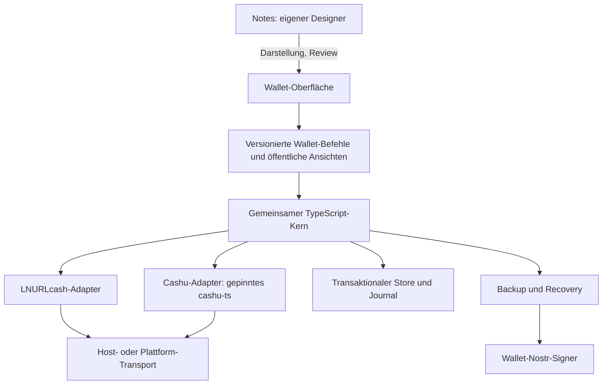

# Bearlett: Architekturentscheidung nach dem Spec-Check

Status: Empfehlung, keine Neuimplementierung. Grundlage:
[Machbarkeitsbericht](FEASIBILITY-2026-09-09.md) und
[geprüfte Quellen](SOURCES-2026-09-09.md). Am 9. September 2026 bestätigt:
**V1 hat ein aktiv schreibendes Gerät mit ausdrücklichem Gerätewechsel.**

Nachträgliche Bestandskorrektur: In `G:\Github\TCG600nap` existiert bereits eine
NutFT-Wallet mit verschlüsselter Blossom-/Nostr-Speicherung. Den vorhandenen
Adapter prüfen und wiederverwenden; siehe [TCG-Wallet-Abgleich](TCG-WALLET-2026-09-09.md).
**Granola und die darüber geplanten XMR-/USDT-Swaps sind ausdrücklich V2.**

## Gemeinsamer Kern und Vertrauensgrenzen

`Bearlett`, `Wallet`, `CashuEngine`, `Transfers`, Vault und die Protokollhelfer
sind die Ausgangsbasis. Nicht drei neue Wallets schreiben. Zuerst die
reproduzierten Fehler beheben und danach den Kern aus dem Ordner `napplet`
herauslösen. `window`, Solid, globale Offline-Einstellungen und
`import.meta.env.MODE` dürfen nicht die Kernlogik bestimmen. Sie gehören in
Adapter. `serviceTransport.ts` ist heute noch eine solche Plattformkopplung.



Das Diagramm beschreibt Quellcode-Wiederverwendung. **Ausführungsort und
Vertrauen unterscheiden sich je Plattform:**

| Oberfläche        | Kern / Speicher                                                                                                                                                    | Reale Grenze                                                                                                                                                                               |
| ----------------- | ------------------------------------------------------------------------------------------------------------------------------------------------------------------ | ------------------------------------------------------------------------------------------------------------------------------------------------------------------------------------------ |
| Napplet Wallet    | Vertrauenswürdiger Host führt den gemeinsamen Kern aus; transaktionaler Host-Store. Napplet erhält Ansichten, Reviews und explizit bestätigte Handover-Ergebnisse. | Passt zur NIP-5D-Richtung: Schlüssel/Signieren/Vault im Host. Erfordert neue, als Bearlett-spezifisch bezeichnete Wallet-Capability. Bestehende Cashu-POST-Capability allein reicht nicht. |
| Web/PWA           | Derselbe Kern im First-Party-Webkontext, optional Worker; verschlüsselte IndexedDB-Datensätze und atomare Transaktionen.                                           | Browser-/Origin-/Update-Vertrauen bleibt. Worker erleichtert Serialisierung, ist keine Hardware-Sicherheitsgrenze gegen kompromittierten First-Party-Code.                                 |
| Android/Capacitor | Derselbe TS-Kern in der gebündelten First-Party-App; Kotlin-Adapter für Datenbank, Key-Wrapping, Signer und Lifecycle.                                             | JS verarbeitet Wallet-Secrets im entsperrten Zustand. Keystore schützt den Wrapping-Key, nicht automatisch den laufenden JS-Prozess.                                                       |

Der aktuelle Napplet-Vault darf als Test-/Migrationsquelle erhalten bleiben.
Er verarbeitet Seed und Proofs selbst und ist deshalb nicht als strikt
hostverwahrte Wallet zu bewerben. Eine standardnahe Version benötigt den Host-
Dienst. Dieser soll Wallet-Befehle statt beliebiger URLs/POST-Bodys freigeben,
z.B. vorbereiten, bestätigen, Zustand abgleichen, Backup exportieren. Der Host
bindet jeden Auftrag an Artefakt, Wallet-ID, Benutzerfreigabe und Revision.
Ein Design-Intent erhält niemals eine Spend-Freigabe.

### Speicher- und Transaktionsvertrag

Ein Wallet-Writer serialisiert **alle** Protokolle, Transfers, Annotationen,
Importe und Backups. UI-`busy`, zwei getrennte Klassen-Mutexe oder eine
Service-Map pro Shell-Tab sind dafür nicht ausreichend.

Ein Store-Commit muss Inputs, vorbereitete Outputs, Counter, Operation,
Transferreferenzen und neue Eigentumsstände atomar bzw. in nachweisbar
wiederaufnehmbaren Journal-Schritten speichern. Eine persistente Operation
enthält mindestens ID, Typ, Phase, Wallet-/Writer-Revision, Mint/Keyset/Einheit,
Inputs, exakte Outputs und Blinding-Daten, Quote, Invoice-Hash, Fee-Limit und
gegebenenfalls NUT-20-Key. Niemals Secrets in Diagnose-Logs.

Web: IndexedDB-Transaktion mit Revision und einem lokalen exklusiven Writer
(Web Locks, soweit verfügbar; sonst konkurrierende Writer verweigern).
Android: SQLite-Transaktionen mit geprüftem Commit-/Sync-Verhalten hinter
Kotlin-Adapter; verschlüsselte Records oder eine separat lizenzgeprüfte
Datenbankverschlüsselung. NAP-STORAGE bleibt für unkritische Napplet-Einstellungen.
Kehtos `ok:false`-Fehler muss vorher Ende-zu-Ende korrigiert werden.

Die Bitcoin-/Lightning-/Mint-Seite und der lokale Store können keine gemeinsame
ACID-Transaktion bilden. Deshalb bleibt die Brücke ein persistierter Ablauf mit
Wiederaufnahme. Vor jedem möglichen Wertverbrauch speichern; nach Abbruch anhand
der bestehenden Operation prüfen. Niemals aus Timeout eine neue Zahlung ableiten.
Erfolg erst nach gesicherten Ziel-Assets **und** gebuchtem/abgeklärtem Wechselgeld.

## Schlüssel und Recovery

### Empfehlung für V1

Die bestehende BIP39-Phrase für LNURLcash und Cashu erhalten. Die beiden
Protokolle behalten ihre dokumentierten Ableitungen: LNURLcash `m/139'` mit
Dienstableitung, Cashu gemäß NUT-13 einschließlich Keyset-Versionen; NUT-20
separat `m/129373'/20'/0'/0'/{counter}`. Der vorhandene Storage-Root-Kontext ist
eine projektinterne Ableitung, kein generischer Wallet-Standard.

Zusätzlich einen **zufälligen, nur für Bearlett verwendeten Nostr-Schlüssel**
im vertrauenswürdigen Host oder externen Signer anlegen. Keine Ableitung aus
npub, keine Verwendung des Social-Keys. NIP-07 stellt nur APIs bereit und
erzeugt keinen standardisierten Wallet-Key. Der Onboardingflow muss Erstellung,
Auswahl des richtigen Kontos und Sicherung ausdrücklich unterstützen.

| Variante                                                   | Bewertung                                                                                                                                                                                                                                                                  |
| ---------------------------------------------------------- | -------------------------------------------------------------------------------------------------------------------------------------------------------------------------------------------------------------------------------------------------------------------------- |
| Ein Master-Mnemonic für beide Protokolle und Nostr         | Technisch möglich, aber neue dokumentierte Ableitung und unabhängige Vektoren nötig. NIP-06 beschreibt `m/44'/1237'/account'/0/0`, ist aktuell ausdrücklich `unrecommended`. Nicht als unproblematischen Standard verkaufen. Seedverlust/Diebstahl betrifft alle Bereiche. |
| Bestehende Wallet-Phrase plus eigener zufälliger Nostr-Key | Empfehlung: keine neue Schlüsselkonstruktion, Trennung vom Social-Key und unabhängiger Keywechsel. Nutzer braucht beide Recovery-Komponenten.                                                                                                                              |
| Externer Signer mit eigenem Wallet-Konto                   | Gute Alternative, wenn Signieren **und NIP-44 Encrypt/Decrypt** verfügbar sind und dessen Backup beherrscht wird. Ein reiner Signer ohne Entschlüsselung reicht nicht.                                                                                                     |

NUT-27 bietet bereits eine deterministische Nostr-Ableitung für **Mintlisten-
Backups**. Sie ist für genau dieses interoperable Format geeignet, nicht
automatisch die Wallet-Nostr-Identität oder ein vollständiges Vault-Backup.

Web: Schlüssel nur im vertrauenswürdigen Kontext erzeugen, mit CSPRNG und
erprobter Bibliothek. Lokalen Key verschlüsselt speichern, Passwort-KDF und
Entsperrung explizit testen; keine Klartext-Keys in localStorage. Der aktuelle
PBKDF2-/AES-GCM-Code ist vorhandene Mechanik, kein abgeschlossener Sicherheitsreview.

Android: Keystore-AES-Wrapping-Key mit Authentifizierung, soweit Gerät/OS dies
unterstützen; Security-Level/StrongBox-Verfügbarkeit prüfen, nicht voraussetzen.
Nostr/secp256k1-Signieren ist keine generell zugesicherte Keystore-Funktion.
Mit externem Signer bleibt dessen privater Nostr-Key dort. Der Wallet-Kern
erhält weiterhin entschlüsselte Walletdaten. Nach Lock, App-Hintergrund und
Prozessneustart erneute Entsperrung und Journalprüfung verlangen.

### Signer-Adapter und Kontrollnachweis

- Web: NIP-07 mit Featureprüfung, alternativ NIP-46; Paja kann diese beiden
  Backends bereits. Kein `window.nostr` im Napplet.
- Android: NIP-55 über explizit gebundene Package-Intents/ActivityResult und
  nach erteilter Berechtigung ContentResolver, z.B. mit Amber. NIP-46 ist eine
  zusätzliche, netzabhängige Alternative. NIP-55-Callbacks im Browser haben
  URL-/Clipboard-/Lifecycle-Grenzen und sind für große Vaults kein guter Kanal.
- `getPublicKey` oder npub ist nur Identifikation. Mit zufälliger Challenge,
  Ablauf und Anwendungskontext lokal eine Signatur prüfen; keine öffentliche
  Veröffentlichung des Nachweises nötig. Zusätzlich einen bekannten NIP-44-
  Testciphertext entschlüsseln lassen. Wiederkehrende Antworten an Request-ID,
  aktive Wallet und ausgewähltes Signer-Konto binden.
- Bei Ablehnung, Accountwechsel, verlorener Activity-Antwort oder fehlender
  Berechtigung kein neues Wallet erstellen und keine Transaktion wiederholen.

### Recovery-Paket ohne Zirkelschluss

Ein Relay-Backup kann nicht seinen einzigen Entschlüsselungsschlüssel nur in
sich selbst enthalten. Separat sichern: Wallet-Phrase, Wallet-Nostr-Key bzw.
Signer-Recovery, Relay-/Snapshot-Locator und ein passwortverschlüsseltes
Vollbackup. Bei externem Signer muss dessen Recovery separat beschrieben werden;
ein nicht exportierbarer Android-Wrapping-Key ist kein geräteübertragbares Backup.

Frische Installation: Walletidentität beweisen, Container vollständig
authentifizieren, importierte Bestände sperren, Pending-Journale zuerst
abgleichen, alle bekannten Mints/Keysets mit NUT-07/09 prüfen, Counter nur
vorwärts bewegen. Phrase allein findet weder unbekannte Mints noch Artwork,
Ziel-Quotes oder unbegrenzt große Counter-Lücken. Veraltete Backups ausdrücklich
anzeigen und vor neuer Ausgabe vollständig abgleichen.

## Relay-Backup ist weder Synchronisierung noch Lock

NIP-60 eignet sich zum interoperablen Speichern von Cashu-Proofs (7375), Wallet-
Metadaten (17375) und optionaler Historie (7376). Es enthält nicht unseren
LNURLcash-Zustand, vorbereitete Blinding-Daten, Counter, alle Transferjournale
oder eine atomare Mehrgeräte-Transaktion. Die private P2PK-Wallet-ID in NIP-60
ist außerdem nicht der Nostr-Signierschlüssel. NIP-61 sind P2PK-Nutzaps und
bleiben außerhalb V1.

Empfehlung: **NIP-78 als Transportcontainer für Bearlett-spezifische vollständige
verschlüsselte Recovery-Daten**, nicht als angeblich universelles Cashuformat.
NIP-44 an den eigenen Wallet-Pubkey und Eventsignatur; App-Schema explizit
versionieren. NIP-60 später als geprüften Import-/Exportadapter anbieten, ohne
ihn mit dem Recovery-Journal gleichzusetzen. NUT-27 optional für die Mintliste.

Noch kein endgültiges neues Event-/Chunkformat festlegen: zuerst Roundtrip mit
den tatsächlich gewählten Signern und Relays prüfen. Die aktuelle NIP-44 kennt
erweiterte Nachrichtenlängen oberhalb 65.535 Bytes; ältere Implementierungen
und Relay-Limits können diese trotzdem ablehnen. Wallet-Artwork nicht ungeprüft
in jedes Journal-Backup duplizieren. Bei notwendigen Chunks muss ein signierter
Commit sämtliche Hashes/Anzahl/Revision binden und unvollständige Sets ablehnen.

Backup-Status getrennt führen: lokal committed, zum Relay gesendet, Relay-ACK,
verifizierter Read-back und letzter erfolgreich geprüfter Restore. Für
Resilienz unabhängige Relays plus Dateibackup empfehlen. Zwei ACKs ersetzen
keinen Restore-Test und keinen garantierten Aufbewahrungsvertrag.

| Störung                                            | Erforderliches Verhalten                                                                                                                                                                                        |
| -------------------------------------------------- | --------------------------------------------------------------------------------------------------------------------------------------------------------------------------------------------------------------- |
| Relay nicht erreichbar / ACK verloren              | Lokale Journalwahrheit erhalten, denselben Event erneut senden/abfragen; nie eine Zahlung neu auslösen. Backup-Verzug sichtbar machen.                                                                          |
| Alte gültige Events / unterschiedliche Relay-Heads | Revision, Parent, lokale High-Water-Marks und erwartete Wallet-ID vergleichen; Konflikt sperren. Auf völlig neuem Gerät ist eine vollständige Rollback-Erkennung ohne unabhängigen Checkpoint nicht garantiert. |
| Manipulierter oder unvollständiger Snapshot        | Signatur, NIP-44-Authentifizierung, vollständiges Schema und Commit-Verzeichnis prüfen; Import vor jeder Mutation ablehnen.                                                                                     |
| Key kompromittiert                                 | Alte Ciphertexts gelten als lesbar. Signer-Key wechseln schützt alte Backups nicht rückwirkend; vorhandene spendbare Assets in neue Wallet/Seed rotieren und neue Backup-Identität anlegen.                     |
| Relay löscht Events / NIP-09 ignoriert             | Löschung nicht als sichere Vernichtung voraussetzen. Historische Proofs nur verschlüsselt; Offlinekopie behalten.                                                                                               |
| Metadaten                                          | Pubkey, Zeit, Größe, Relay-IP und Zugriffsmuster bleiben sichtbar. Keine Mintnamen, Beträge oder Proofs in öffentlichen Tags.                                                                                   |

## Gerätewechsel mit einem Schreiber

Gewöhnliche Relays liefern keine atomare Wahl eines Writers. Für V1 ist daher
ein **kooperativer, ausdrücklich ausgeführter Gerätewechsel** vorgesehen:

1. Quellgerät nimmt keine neuen Wallet-Befehle an. Laufende Operationen werden
   beendet oder vollständig als pending journalisiert; keine unklare Zahlung
   „freigeben“.
2. Quelle speichert einen dauerhaften Handover-Zustand, finale Revision,
   Counter und Zielgerätbindung. Daraus einen vollständig authentifizierten
   Transfer-/Recovery-Checkpoint erzeugen. Quelle bleibt schreibgesperrt.
3. Ziel importiert, prüft Wallet-/Signeridentität, Vollständigkeit und
   Zielbindung. Es übernimmt sämtliche Pending-Operationen. Wiederaufnahme
   benutzt dieselben vorbereiteten Requests und keine neuen Zahlungen.
4. Ziel aktiviert die neue Writer-Epoche erst nach erfolgreichem Commit und
   Abgleich. Quelle speichert den abgeschlossenen Wechsel; bei Crash bleibt
   sie gesperrt. Nach verlorenem ACK nur diesen Wechsel fortsetzen.
5. Rückwechsel ist ein neuer expliziter Handover. Eine alte Datei zu importieren
   darf nicht automatisch Schreibrechte wiederherstellen.

Das ist kein kryptografisches Fencing gegen einen bösartigen oder aus altem
Backup wiederbelebten Client, der dieselben Seeds/Proofs besitzt. Bei verlorenem
oder kompromittiertem Quellgerät deshalb Recovery in eine neue Wallet/Seed mit
Rotation der erreichbaren Guthaben; bei offline gebliebenen Mints deren Assets
gesperrt lassen. Nicht behaupten, ein Nostr-Event könne bestehende ungebundene
Bearer-Secrets ungültig machen.

## Android-Alternativen

| Ansatz                                       | Signer / sichere Ablage / Gerätefunktionen                                                                                                                  | Wiederverwendung und Urteil                                                                                                                                                                    |
| -------------------------------------------- | ----------------------------------------------------------------------------------------------------------------------------------------------------------- | ---------------------------------------------------------------------------------------------------------------------------------------------------------------------------------------------- |
| Web/PWA + Capacitor + kleine Kotlin-Adapter  | NIP-55-Bridge, Keystore-Wrapping, transaktionale SQLite-Bridge, Kamera/NFC und Activity-Restore explizit implementieren/testen. Preferences ist kein Vault. | Höchste Wiederverwendung des bestehenden TS-Kerns und Solid-UI. **Bevorzugter Validierungspfad**, Freigabe erst nach echtem Gerätetest.                                                        |
| Native Kotlin/Compose                        | Sehr direkte Android-Lifecycle-, NFC-, Keystore- und Signer-Anbindung.                                                                                      | Eine zweite Implementierung der Walletlogik oder zusätzliche JS-Engine-/FFI-Grenze wäre nötig. Höherer Prüf-/Wartungsaufwand. Nur wählen, wenn der Adapter-Spike konkrete harte Grenzen zeigt. |
| React Native                                 | TS-Kern gut wiederverwendbar, native Module für Signer/Speicher/Lifecycle nötig; Solid-UI nicht direkt wiederverwendbar.                                    | Sinnvolle Alternative bei längerfristigem Bedarf an nativer UI; derzeit zusätzlicher UI-Neubau ohne belegten Nutzen.                                                                           |
| Kotlin Multiplatform / gemeinsamer Rust-Kern | Kann langfristig Walletkern nativ teilen; Web verlangt passende Bindings.                                                                                   | Jetzt weitgehender Ersatz des getesteten TS-Kerns und neues Kryptobibliotheks-/Interop-Risiko. Für V1 nicht gerechtfertigt.                                                                    |

Capacitor selbst ist ein FOSS-Kandidat; keine proprietären Cloud-,
Secure-Storage- oder Live-Update-Dienste voraussetzen. AndroidX und Android-
Werkzeuge haben eigene Lizenzen: MIT für Bearlett heißt nicht, dass sämtliche
Werkzeuge ebenfalls MIT sind. Einen APK-Sideload kann man ohne Storekosten
testen. WebView darf nur gebündelte vertrauenswürdige App-Dateien laden;
Navigation, externe Inhalte und JS-Bridge-Zugriffe begrenzen. Tests müssen
echte Kill-/Neustartfälle abdecken, nicht nur `pause`/`resume`-Events.

## Ergänzung: gewünschte XMR-/USDT-Swaps über Granola

Während der Prüfung ausdrücklich gewünschte Richtung: **möglichst über Mints
mit Brenos Granola tauschen**. Diese Präferenz ersetzt die zunächst erwogene
allgemeine Swap-Anbieter-Anbindung. Sie ist eine zusätzliche Ausbaustufe und
kein Nachweis heutiger XMR-/USDT-Funktionalität.

Vorgesehener Ablauf:

```text
LNURLcash --Lightning--> Cashu-Sats
                           |
                     Granola-HTLC-Swap
                           |
                 XMR-/USDT-gedecktes Ecash
                           |
                 Einlösung beim Asset-Mint
                           |
                 natives XMR / USDT-Netzwerk
```

[Granolas Settlement-ADR](https://github.com/brenorb/granola/blob/e25a4ec651512045e13bc2d7d8fcee00cb9d5658/docs/adr/0004-cashu-htlc-settlement.md)
belegt Cashu-HTLCs über einen oder zwei Mints, unter Annahmen über ehrliche
Durchsetzung, Erreichbarkeit, Zeit und verfügbare Spend-Witnesses. Granola
emittiert selbst kein XMR/USDT und garantiert keine anschließende Auszahlung
auf einer Blockchain. Ein USD-Cashu-Token ist nicht allein wegen seiner
Einheit durch USDT gedeckt. Eine mintbasierte Asset-Forderung muss in der
Oberfläche als solche erkennbar bleiben.

Im geprüften Code verwenden Quick-Mint und Dashboard sat/usd;
`src/api/order-api.ts` wählt einen SAT/USD-Markt. Unterliegende Settlement-
Funktionen transportieren Einheiten, aber daraus folgt keine getestete
universelle Asset-Unterstützung. Es wurde kein funktionierender XMR-/USDT-Mint
mit passenden Ein-/Auszahlungen nachgewiesen.

Erforderliche Erweiterungen:

- Explizite Asset-Identität einschließlich Mint, Einheit, atomarer Stückelung,
  Deckung und Einlösungsbedingungen. USDT-Netzwerk und gegebenenfalls Contract
  gehören zum Auszahlungsvertrag; frei benannte `usd`-/`xmr`-Strings genügen nicht.
- Mints mit den von Granola verlangten NUT-07/11/12/14-Fähigkeiten, korrekten
  Witnesses, Uhren und Refund-Pfaden; Asset-Backend für XMR bzw. USDT separat
  prüfen. Der heutige LND/Nutshell-Sats-Aufbau stellt diese Backends nicht bereit.
- Handelspartner/Liquidität und exakte Preis-/Gebührenrechnung pro Einheit.
  Granola vermittelt Angebote, erzeugt aber keine garantierte Liquidität.
- Eigener persistenter Swap-Ablauf im gemeinsamen Wallet-Writer: Session-,
  Claim- und Refund-Schlüssel, Preimage, Fristen und beide Legs vollständig
  sichern. Kein zweites Wallet mit unkoordinierten Proof-Reservierungen.
- Erst isolierter Testnut-SAT/USD-Flow samt Abbruch/Refund; danach belegte
  Asset-Mints und Testnet-Einlösung. Eine vollständig atomare Kette von
  LNURLcash bis zur Blockchain-Auszahlung wird nicht behauptet.
- Vor Codeübernahme Granolas fehlende Lizenzfreigabe klären. Öffentliches
  Repository und bestandene Tests allein erlauben keine MIT-Umlizenzierung.

Direktes XMR-Ecash ↔ USDT-Ecash wäre dieselbe Kategorie eines Cashu-Marktes,
sofern Assets, Mints und Liquidität nachgewiesen sind. Native Cross-chain-
Atomic-Swaps sind dafür keine Voraussetzung; das Mint-Vertrauen bleibt bestehen.

## Gestufter Umsetzungsplan

| Stufe                  | Arbeit                                                                                                                                                    | Abnahme                                                                                                                                                                                                                                  |
| ---------------------- | --------------------------------------------------------------------------------------------------------------------------------------------------------- | ---------------------------------------------------------------------------------------------------------------------------------------------------------------------------------------------------------------------------------------- |
| 0: Fehlergrenzen       | F00–F04 korrigieren; vollständige Wertbilanz und atomare Import-Identität; Testreproduktionen in Invariantentests umwandeln.                              | Negative Storage-ACK/Readfehler blockieren jede Mint-Mutation; fehlendes Change bleibt pending; manipulierte/fremde Backups werden vor Writes abgelehnt; Counter-Lücke 100 wird gefunden. Bestehende 353 Tests und Regtest bleiben grün. |
| 1: Gemeinsamer Kern    | Plattformabhängigkeiten extrahieren, Store-/Transport-/Signer-Ports, ein Writer für alle APIs, konsistente Backups; LNURLcash-Funktionen erhalten.        | Dieselben Fault-Fixtures laufen über Web- und Host-Adapter; parallele Aufrufe verlieren keine Updates; keine import.meta/window-Abhängigkeit in der Domainlogik.                                                                         |
| 2: Napplets/Host       | Hostverwahrter Wallet-Dienst, echte Cashu-/LNURLcash-Freigaben, durable Storage, App-Upgrade, Intent-Cold-start; Notes separat.                           | Verifizierte Artefakte im echten Paja, denied/granted, zwei Host-Tabs, Storage-Ausfall, Reload und Update getestet; Design enthält keine automatisch eingefügten Secrets.                                                                |
| 3: Web/PWA             | Bearlett-Oberfläche mit beiden Protokollen, IndexedDB, Offlineansicht, NIP-07/NIP-46, Kameraoption; keine Offline-Ausgaben ohne persistente Reservierung. | Installation/Reload, verlorene Antwort, Browserkill, Offline-Reconnect, Quota und Datenmigration getestet; Service Worker wiederholt keine Mutationsrequests.                                                                            |
| 4: Backup/Handover     | NIP-44/NIP-78-Roundtrip, getrennte Signer-Recovery, vollständiger Snapshot, expliziter Writerwechsel.                                                     | Neue Browserinstallation aus Backup; zwei getrennte Profile; Quelle nach Handover gesperrt; Abbruch vor/nach jedem Checkpoint; veralteter Snapshot/Relay-Ausfall erkennbar; kein zweiter Melt.                                           |
| 5: Android-Spike       | Minimaler gebündelter Client mit gleichem Kern; Kotlin-Bridges für Keystore/SQLite/NIP-55; ein Regtest-Flow, Kamera/NFC.                                  | Echtes Android-Gerät + Emulator; Signerablehnung/-wechsel, Activityverlust, force-stop/Neustart, Geräte-Lock, Speicherfehler, Backup und Handover bestanden. Erst danach Capacitor endgültig bestätigen.                                 |
| 6: Freigabe            | Fehler-Matrix vervollständigen, offizielle Vektoren, unabhängiger Review, zusätzliche Mintimplementierung, Lizenz-/Upgradeprüfung.                        | Dokumentierte Invarianten und Artefakte, keine offenen P1-Befunde, reproduzierbare Builds. PR/Review vor Merge; öffentliche Veröffentlichung separat entscheiden.                                                                        |
| 7: Granola-Erweiterung | Gewünschter mintbasierter Asset-Tausch; zunächst Testnut, danach XMR-/USDT-Mints nur bei belegter Einlösung.                                              | Lizenz geklärt, Cashu-HTLC-Claim/Refund nach Prozesskill bestanden, Asset/Netzwerk eindeutig, Liquidität und Testnet-Ein-/Auszahlung nachgewiesen.                                                                                       |

Die Größen- und Netzwerkgrenzen, genauen Prüfkommandos sowie noch fehlenden
Geräte stehen im [Infrastrukturplan](INFRASTRUCTURE-2026-09-09.md).
