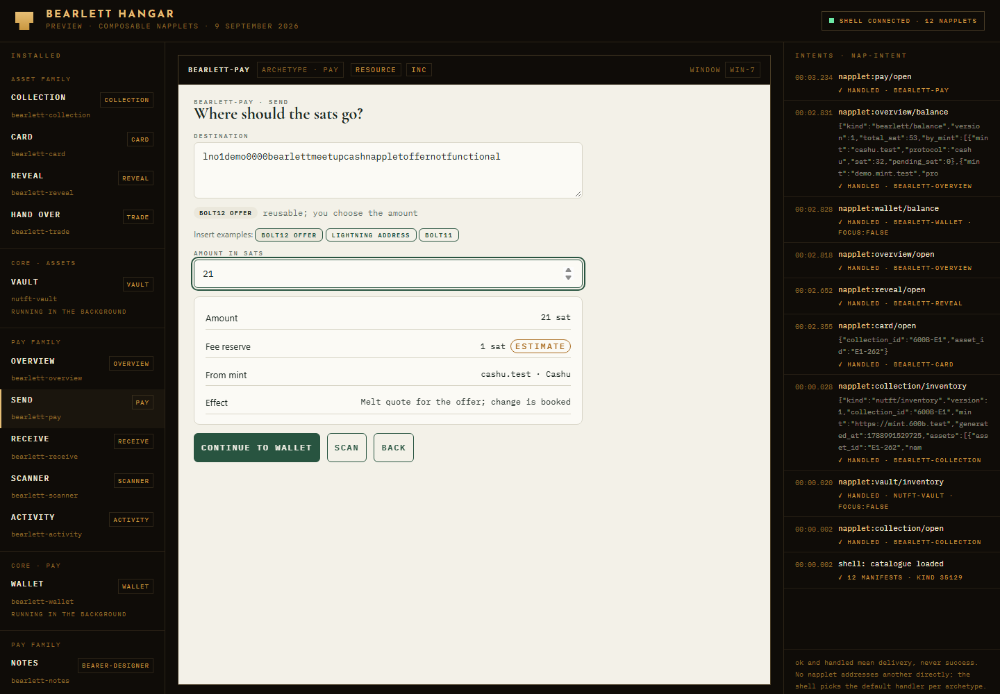
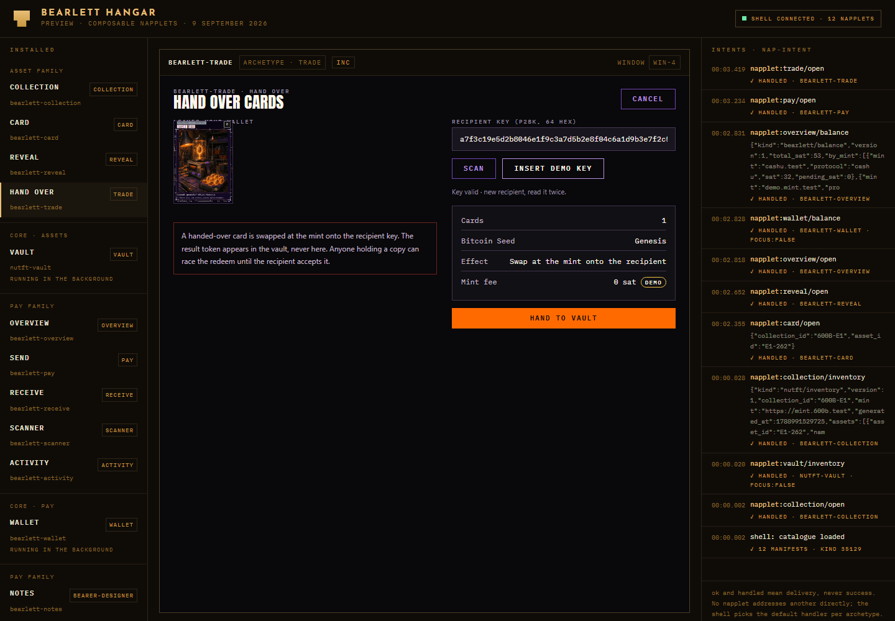

# Bearlett UI: composable Napplets, Assets als Spielerlebnis, Pay als Bitcoin-Wallet

Stand: 9. September 2026. Status: Designentwurf und Empfehlung, keine Implementierung.
Grundlage: Bearlett `8b02e62` (Branch `fix/bearlett-security-boundaries`),
TCG-Wallet `G:\Github\TCG600nap` `d753505` (`feature/g-mint-live`),
Nappelin `G:\Github\nappelin.com` `1b2f2c8`, napplet/naps `a040914` (20. August 2026),
cashu-ts 4.10.1 wie installiert. Web-Recherche vom 9. September 2026, Quellen in
Abschnitt 12.

## Ergebnis in Kürze

- **Jede Funktion ist ein eigenes Napplet.** Zwölf Napplets in zwei Familien, alle
  über NAP-INTENT und Archetypen verbunden, nichts hart verdrahtet. Geheimnisse leben
  in genau zwei Kern-Napplets; alle anderen sind Oberflächen ohne Secrets. Katalog in
  Abschnitt 7.
- **Assets als Spielerlebnis.** Sammlung, Karte, Öffnen und Weitergeben sind eigene
  Napplets mit 3D und Choreografie. Die Karten sind die vorhandenen NutFT-Karten der
  TCG-Wallet, keine neuen Token.
- **Pay als aufgeräumtes Bitcoin-Wallet.** Übersicht, Senden, Empfangen, Scanner und
  Aktivität als eigene Napplets; Lightning mit BOLT11 und BOLT12, dazu LNURLcash und
  Cashu. BOLT12 ist in cashu-ts 4.10.1 vorhanden und in Bearlett noch nicht angebunden.
- **Animations-Stack:** Zeitachsen-Kompositionen nach dem HyperFrames-Vertrag,
  ausgeführt mit der reinen Zustandsfunktion des Nappelin-Intros statt mit GSAP.
  CSS-3D für Karten, Three.js 0.182 nur dort, wo ein Körper gebraucht wird.
- **Harte Rahmenbedingung:** Ein Napplet ist eine Inline-Datei in einem iframe mit
  `sandbox="allow-scripts"` und einer CSP ohne Netz, ohne externe Skripte, ohne Fonts.
  Ein Wallet-Fenster je Speicherbereich, keine Transaktionen über Fenster hinweg.

## 1. Vorgaben

Wörtlich vom Auftraggeber in dieser Sitzung: Gaming-Assets sind der Weg. Die
Benutzeroberfläche ist alles: ein spielähnliches Erlebnis mit Animation und 3D.
Getrennte Napplet-Screens, einer für Assets, einer sauber wie ein Bitcoin-Wallet zum
Bezahlen, am besten mit integriertem Lightning, BOLT11 und BOLT12. Das Nappelin-Intro
als Referenz für den Animations-Stack. Hyperframe-Stil für Napplets, zu recherchieren.
Jede Funktion ein eigenes Napplet, alles
composable. Intent und Archetyp nicht vergessen und sauber dokumentieren. Keine Fehler.

## 2. Scope-Entscheidung und ihre Folgen

Der Startprompt legt V1 auf LNURLcash und ungebundene Cashu-Sats fest und verbietet,
andere Einheiten oder P2PK-Token stillschweigend aufzunehmen. Die NutFT-Karten sind
genau das: Cashu-Proofs mit `amount = 1`, per Tag an `collection_id`, `asset_id`,
`catalog_uri` und ein `asset_binding` gebunden, mit P2BK-Schlüssel des Halters und
eigenen Keyset-Einheiten `600B-E1` und `600B-G`
(`TCG600nap/site/nutft-wallet.js:109`, `:581-595`).

Die Aufnahme ist damit eine ausdrückliche Entscheidung des Auftraggebers, keine
stillschweigende Erweiterung. Das Design setzt voraus:

1. Die Protokollkerne bleiben getrennt, wie in
   [TCG-WALLET-2026-09-09.md](TCG-WALLET-2026-09-09.md) festgehalten. Die Karten-
   Napplets sprechen mit dem NutFT-Kern, die Pay-Napplets mit dem Bearlett-Kern.
2. Beide Familien nutzen denselben Zugang und dieselbe Backup-Strecke aus
   [NAPPELIN-INTEGRATION-2026-09-09.md](NAPPELIN-INTEGRATION-2026-09-09.md).
   Login-Schlüssel und Geldschlüssel bleiben getrennt.
3. Granola, Märkte und Preise bleiben V2. Kein Floor-Preis, kein Handelsplatz.

## 3. Bestand, auf dem das Design aufsetzt

### 3.1 Bearlett Wallet-Napplet (`src/napplet/`)

- SolidJS, ein Tab-Switcher ohne Router (`main.tsx:57`, Navigation `main.tsx:559`):
  Wallet, Receive, Pay, Mint, Backup, dazu ein Select "More wallet tools".
- Asset-Modell `Note` (`vault.ts:31-48`): `protocol`, `id`, `url`, `amount`,
  `status`, `designId`, `label`, `hidden`, `needsRotation`. Cashu-Einheit fest `sat`
  (`cashu/engine.ts:85`). Kein Begriff von Sammlung, Serie, Medium oder Seltenheit.
- Gestaltung `NoteDesign` (`design.ts:1-7`): Titel, Untertitel, Tinte, Papier, Bild
  als Data-URL bis etwa 130 KB. Banknote quer 2,38:1 (`banknote.css`), Grid mit zwei
  Spalten (`style.css:413`), nur helles Schema, vier CSS-Tokens, keine Icons.
- Blossom kommt im Code nicht vor, nur in Dokumenten.
- Sichtbare Identität (`docs/screenshots/wallet-desktop.png`): cremefarbenes Papier,
  dunkelgrüne Tinte `#285440`, Guillochen, Serifenziffern, Statuspillen, Mint-Chips.
- Bestehende Verträge ([NAPPLETS.md](NAPPLETS.md)): Archetyp `wallet` mit
  `napplet:wallet/open`, `/receive`, `/pay`, `/design`; Archetyp `bearer-designer`
  mit `napplet:bearer-designer/open`. Beide sind lokale, unregistrierte Vorschläge.
  Manifest-Anforderungen `storage`, `resource`, `inc` (Wallet) und `storage`, `inc`
  (Notes). INC-Topics werden synchron beim Start registriert; der Shell gehört die
  Kaltstart-Zustellung; ein neuer Auftrag ersetzt nie eine laufende Prüfung.

### 3.2 TCG-Wallet (`G:\Github\TCG600nap`)

- **Kartenbild:** `{mirror}/{sha256}.webp` auf `blossom.primal.net`,
  `blossom.bimcvp.com`, `nostr.download`; Seitenverhältnis 5:7. Vor der Anzeige
  werden Größe bis 3 MB, Byte-Länge und Hash gegen den signierten Katalog geprüft
  (`site/wallet.html:364-376`).
- **Zensus** (`cards/nutft-census.json`, `tier-census-r3`): je Karte `tier`, `copies`,
  `one_in_packs`, `pool`, `rank`. Edition One: Genesis 63 Exemplare und 1 von 998
  Packs, Vault 189 und 1 von 333, Rare 648 und 1 von 97, Uncommon 2.511 und 1 von 25,
  Common 6.975 und 1 von 9, Basic unbegrenzt. Seltenheit kommt aus dem Mint
  (`docs/adr/0004-mint-tier-authority.md`).
- **Sammlung heute** (`site/wallet.html`): Grid `minmax(150px, 1fr)`, Duplikate als
  Stapel `×N`, seltenste zuerst, Zähler CARDS, DISTINCT, DUPES, getrennte Bereiche für
  unlesbare und ungültige Token, Trade-Desk, Sync, Backup.
- **Booster-Reveal** (`site/shop.html:233-280`, `site/shop.js:427-880`): verdeckt
  austeilen, aufladen je nach Seltenheit, 3D-Flip, Burst, Seltenheitslabel.
- **Übergabe:** Empfänger nennt seinen P2BK-Public-Key, Sender tauscht beim Mint
  (`/nutft/trade`) und erhält einen `cashuB…`-Token, den der Empfänger einfügt. Kein
  QR, keine Nostr-DM; Nostr und Blossom dienen dem verschlüsselten Eigen-Backup
  (Kind 37378).
- **Designsystem** (`site/600b.css`): nur dunkel, `--black #09080b`, `--panel #19151f`,
  Ember `#ff6a00` als einzige Aktionsfarbe, Purpur für Struktur, Affinitätspalette
  (Power, Bitcoin, Keys, Signal, Timelock), Display-Font Anton600, `--radius: 0`.

### 3.3 Nappelin: Marke, Intro, 3D

- **Brass Terminal** (`design/logo-system/design_handoff_nappelin_brand/README.md`):
  Iron `#0f0c08`, Brass `#e7bf76`, Brass-2 `#c9973f`, Brass-3 `#8f6a2a`, Parchment
  `#ece3d0`, Signal-Grün `#6de8a6`. Das Grüne Gesetz: höchstens ein grünes Element,
  Grün heißt nur verifiziert, live oder an. Ein einziger Verlauf. Radius 0, Rahmen
  1 px. Josefin Sans für Headlines, IBM Plex Mono für Labels; nie Inter, Roboto, Arial.
- **Bewegungsgesetz** für Produkt-UI: Schnitte und Stufen statt Tweens, Übergänge 160
  bis 240 ms ease-out, ein erlaubter Überschwinger beim Andocken. Nichts schwebt,
  nichts hüpft, nichts glüht.
- **Intro-Architektur** (`site/assets/intro.js`): `computeIntroState(T)` als reine
  Funktion der Zeit, `renderFrame` als Maler, Easing-Presets `enter`, `glide`, `pop`,
  `suck`, deterministischer Zufall, Start-Gate, synthetisierte Musik; abgesichert
  durch `tests/intro-state.test.mjs`.
- **3D im Sandkasten** (`apps/avatar-viewer/src/model.ts`): Three.js 0.182; GLB als
  Bytes über den Resource-NAP, Draco-Decoder eingebacken, Worker über Blob-URL.

## 4. Referenz: die besten NFT-Wallets

Recherche vom 9. September 2026 (Quellen 12.4). Reviewer setzen Phantom, Rainbow,
Zerion, Family und Trust Wallet vorn; MetaMask wegen Marktplatz-Integration, nicht
wegen der Galerie. Magic Eden Wallet wurde am 1. Mai 2026 eingestellt, Coinbase Wallet
heißt seit Juli 2025 Base App.

| Wallet      | Galerie                                                                             | Detail                                                                                        | Senden                                                                                           | Verstecken                                                                                          | Medien                                                                                          |
| ----------- | ----------------------------------------------------------------------------------- | --------------------------------------------------------------------------------------------- | ------------------------------------------------------------------------------------------------ | --------------------------------------------------------------------------------------------------- | ----------------------------------------------------------------------------------------------- |
| Phantom     | Gruppierung nach verifizierter Sammlung, Namens-Prioritätskette, Favoriten anpinnen | Verifiziert-Häkchen mit Hinweis "keine Sicherheitsgarantie", On-Chain-Name vor Off-Chain-JSON | Adresse, Name, QR; Vorschau mit Gebühr und Empfänger; Warnung bei neuer Adresse; Netzwerkprüfung | Automatisch nach Vertrauenssignalen, melden, verbrennen; Copy "Wiederherstellen heißt nicht sicher" | Reihenfolge Animation, Dateien mit CDN, Bild; Thumbnails 256 px                                 |
| Rainbow     | Sammlungsliste oder Galerie-Grid, Sortierung neu/alphabetisch                       | Download, Marktplatz-Links, Metadaten aktualisieren                                           | ENS-Namen                                                                                        | Verstecken mit reversiblem "Hidden"-Tab                                                             | 3D `.glb` im sandboxed Viewer, Video nativ gecacht; delistete Sammlungen erscheinen als fehlend |
| Family      | Galerie-Modus mit Wischen, Stern-Sortierung                                         | Name, Beschreibung, Eigenschaften, Metadaten aktualisieren                                    | Mehrfachauswahl in einer Transaktion, Prüfbildschirm, Simulation, Biometrie                      | Verstecken, Papierkorb statt Verbrennen, Auto-Papierkorb für Spam                                   | Video, Audio, Bild, 3D, interaktiv                                                              |
| MetaMask    | Autodetect opt-in, manueller Import                                                 | Preis- und Metadaten                                                                          | Adresse, Weiter, Bestätigen; Blockaid-Warnungen                                                  | Markieren als verdächtig, reversibel                                                                | Platzhalter bei nicht unterstützten Medien, IPFS-Gateway wählbar                                |
| Zerion      | Cross-Chain-Galerie, Widgets                                                        | nicht dokumentiert                                                                            | Simulation "wisse, was du signierst"                                                             | Spam aus Portfolio und Verlauf                                                                      | –                                                                                               |
| Trust       | Gruppierung nach Sammlung, Suche, Filter                                            | Name, Beschreibung, Eigenschaften, Verlauf                                                    | Netzwerkprüfung                                                                                  | Filter standardmäßig an, melden, "nicht interagieren"                                               | –                                                                                               |
| Ledger Live | Galerie, Sammlungen verstecken                                                      | –                                                                                             | Clear Signing zeigt Sammlung und Karte auf dem Gerät                                             | –                                                                                                   | –                                                                                               |

Muster, die übernommen werden, und wohin sie gehen:

1. Gruppierung nach ausstellerverifizierter Sammlung mit deterministischem Fallback
   und Namens-Prioritätskette: Edition aus dem signierten Katalog, sonst Mint plus
   Keyset. Napplet _Sammlung_.
2. Zwei Layouts, Liste nach Sammlung und Galerie-Grid, Sortierung neu und
   alphabetisch, Anpinnen. _Sammlung_.
3. Drei reversible Stufen: automatisch verborgen, vom Nutzer verborgen, Papierkorb;
   nie löschen; Copy sagt, dass verborgen nicht sicher heißt. _Sammlung_; die
   TCG-Buckets `unreadable` und `invalid` bleiben getrennt sichtbar.
4. Verifiziert-Abzeichen mit ehrlichem Vorbehalt, abgeleitet aus Signatur und
   Hash, nie aus einer UI-Flagge. _Karte_, ein grünes Element.
5. "Nicht interagieren" plus Melden mit einem Tipp für unerwartete Token.
   _Sammlung_, _Öffnen_.
6. Medienleiter mit fester Thumbnail-Größe, Renderer je Typ, 3D im Sandkasten.
   _Sammlung_, _Karte_; Kartenbilder immer hashgeprüft.
7. "Metadaten aktualisieren" als Nutzeraktion mit der Zusicherung, dass das Asset
   auch bei fehlendem Bild sicher ist. _Karte_.
8. Kein einzelner Indexer oder Host: drei Blossom-Spiegel plus Hashprüfung, wie
   NIP-B7 es beschreibt; Rainbows "delistet gleich fehlend" ist der Fehlerfall.
9. Sendeprüfung zeigt Empfänger, Gebühr und Wirkung in Klartext; Warnung bei neuem
   Empfänger; Formatprüfung. _Weitergeben_, _Senden_.
10. Mehrfachauswahl beim Senden. _Sammlung_ → _Weitergeben_.
11. Empfang über persönlichen QR und lesbaren Namen. _Empfangen_, _Weitergeben_.
12. Backup als Phrase plus optional verschlüsseltes Cloud-Backup mit starkem
    Passwort und der Copy "wir können es nicht wiederherstellen". Kern-Napplets.
13. Nicht übertragbare Assets sichtbar markieren; NIP-58-Abzeichen verlangen sogar
    die Annahme vor der Anzeige. Cashu-Analogie: P2BK-gebunden heißt "an dich
    gebunden". _Karte_.
14. Barrierefreiheit fehlt in allen Reviews; beschriftete Bedienelemente und
    Tastaturpfade werden hier ausdrücklich gefordert.

Im Cashu-, Nostr- und Blossom-Umfeld wurde kein Wallet gefunden, das medientragende
Token anzeigt; Minibits bindet Ecash an den Empfänger-Pubkey, Olas lädt nativ auf
Blossom, NIP-B7 beschreibt die Hashprüfung beim Download. Ein "NFT auf Ecash" war
nicht nachweisbar. Das Kartenmodell der TCG-Wallet ist damit ohne direktes Vorbild.

### 4.1 Was von NFT-Wallets nicht übernommen wird

- **Öffentliche Herkunftskette.** Ein Bearer-Token hat keinen öffentlichen Besitzer.
  Herkunft heißt hier: signierter Katalog, Bindungshash, geprüfter Bild-Hash, Zustand
  beim Mint.
- **Besitz durch Anzeige.** Eine kopierte Karte bleibt ausgebbar. Annahme heißt immer
  Tausch beim Mint; die Sammlung zeigt den Mint-Zustand.
- **Preise und Märkte.** Keine Floor-Preise, kein Marktplatz, keine Gasgebühren;
  Mint-Gebühren werden vor der Übergabe gezeigt.
- **Spam-Verstecken als Hauptfunktion.** Karten kommen nur aus signierten Katalogen.

## 5. HyperFrames als Stilreferenz

Gemeint ist mit hoher Wahrscheinlichkeit **HyperFrames** von HeyGen: "Write HTML.
Render video. Built for agents." Open Source unter Apache-2.0, Repository seit dem 10. März 2026, Version 0.8.33, Stand heute. Nichts mit diesem Namen existiert im
Nostr-, Napplet-, Cashu- oder Lightning-Umfeld; die übrigen "Hyperframe"-Treffer sind
Unternehmen ohne Bezug (Quellen 12.5).

### 5.1 Was HyperFrames ist

- **Autorenvertrag:** eine einzelne selbständige HTML-Datei. Wurzel
  `<div data-composition-id data-width data-height data-start data-duration>`;
  Kinder `class="clip"` mit `id`, `data-start` (absolut oder relativ wie
  `intro + 0.5`), `data-duration`, `data-track-index`. Verschachtelte Kompositionen
  über `data-composition-src` und `<template>`; Variablen über
  `data-composition-variables`.
- **Zeitachse:** eine pausierte GSAP-Timeline je Komposition, synchron auf
  `window.__timelines[id]` registriert; die Laufzeit _sucht_ Zeitpunkte, sie spielt
  nicht ab. Regeln: kein `Date.now`, kein `Math.random`, kein `repeat: -1`, nur
  Transform-Tweens, kein Netz zur Laufzeit.
- **Frame-Adapter:** WebGL und Three.js über `seekFrame(frame)`; gleicher Frame,
  gleicher Zustand, beliebige Sprünge erlaubt.
- **Rendering:** DOM in Headless Chromium je Frame, FFmpeg kodiert. Live im Browser
  über Studio und `<hyperframes-player>`, der aber rund 400 KB Laufzeit vom CDN
  nachlädt.
- **Hausstil** (`skills/hyperframes-creative/references/*.md`): Grund, Vordergrund
  und Akzent vor der ersten Codezeile festlegen; keine Verlaufstexte, kein Neon auf
  Dunkel, kein reines `#000` oder `#fff`, keine identischen Kartenraster, nicht alles
  zentriert. Serif plus Sans mit extremem Gewichtskontrast, Headlines ab 60 px,
  `tabular-nums`. Inter, Roboto, Poppins verboten; empfohlen Oswald, League Gothic,
  Archivo Black, Space Mono, IBM Plex Mono. Fonts als Data-URI eingebettet. Drei
  Tiefenebenen: atmender Hintergrund mit Geistertext und Korn, Mittelgrund mit
  Karten, Vordergrund mit Haarlinien und Mono-Metadaten. Zwei bis fünf ambiente
  Elemente je Szene, immer langsam in Bewegung. Eintritte 0,3 bis 0,6 s mit
  überlappendem Versatz, mindestens drei Easings je Zeitachse, Shader-Übergänge nur
  an Szenengrenzen, sonst harte Schnitte.

### 5.2 Was davon übernommen wird

| Übernommen                                                                                                                                 | Nicht übernommen                    | Grund                                                                                                                                                                                   |
| ------------------------------------------------------------------------------------------------------------------------------------------ | ----------------------------------- | --------------------------------------------------------------------------------------------------------------------------------------------------------------------------------------- |
| Der Autorenvertrag: Clips mit `data-start` und `data-duration`, eine suchbare Zeitachse je Komposition, Determinismus-Regeln               | GSAP als Laufzeit                   | GSAPs "Standard no-charge"-Lizenz ist frei, aber nicht OSI-konform; das Projekt verlangt MIT durchgehend. Das Nappelin-Intro liefert dieselbe Semantik mit eigener `animate()`-Funktion |
| Frame-Adapter für Three.js: `seekFrame` statt freilaufender `requestAnimationFrame`-Schleife                                               | Player und Studio                   | CDN-Nachladen ist in der Napplet-CSP unmöglich; der Player bringt 400 KB Laufzeit mit                                                                                                   |
| Hausstil-Regeln: Farben vorab festlegen, kein reines Schwarz oder Weiß, Gewichtskontrast, `tabular-nums`, eingebettete Fonts, Tiefenebenen | Ambiente Dauerbewegung im Chrome    | Widerspricht dem Nappelin-Bewegungsgesetz; gilt nur im Karten-Register, siehe 10.2                                                                                                      |
| Renderbarkeit: dieselbe Datei bleibt mit `npx hyperframes render` zu einem Demo-Video renderbar                                            | Schader-Übergänge zwischen Napplets | Napplets sind getrennte Fenster; Übergänge finden innerhalb eines Napplets statt                                                                                                        |

HyperFrames' `seekFrame` und Nappelins `computeIntroState(T)` sind dieselbe Idee:
Jeder sichtbare Wert ist eine Funktion der Zeit. Das ist die Grundregel für alle
Choreografien in diesem Entwurf.

## 6. Composable: Grundregeln

1. **Ein Napplet, eine Funktion.** Jedes Napplet hat ein eigenes Manifest, einen
   eigenen Speicherbereich und genau einen Zweck. Kein Tab-Switcher, kein Router.
2. **Kein Napplet adressiert ein anderes direkt.** Aufrufe gehen über NAP-INTENT an
   einen Archetyp; die Shell wählt den Standard-Handler des Nutzers. Vor jeder
   Schaltfläche steht `intent.available(archetype)`.
3. **Geheimnisse nur in Kernen.** Es gibt genau zwei Napplets mit Secrets:
   _Bearlett Wallet_ (Scheine, Cashu-Proofs, Journal) und _NutFT Vault_ (Karten-Proofs,
   P2BK-Schlüssel). Alle Oberflächen erhalten versionierte, reine Anzeige-Nachrichten
   ohne Proofs, Seeds, Schlüssel oder Bearer-URLs, nach dem Muster des vorhandenen
   `NoteDesignMessage`.
4. **Ein Schreiber je Speicherbereich.** NAP-STORAGE kennt keine Transaktionen über
   Fenster hinweg. Deshalb hält der Kern den Zustand, und Oberflächen fragen ihn.
   Anfrage und Antwort sind zwei Intents: die Oberfläche sendet an den Kern-Archetyp,
   der Kern antwortet an den Oberflächen-Archetyp.
5. **Bearer-Secrets reisen nur, wo sie müssen.** `napplet:wallet/receive` und
   `napplet:vault/receive` tragen den einzulösenden Token, wie heute. Ein Token, der
   das Wallet verlässt, wird im Kern angezeigt, nie an eine Oberfläche gesendet.
6. **Bestätigung im Kern.** Oberflächen stellen Aufträge; der Kern zeigt die Prüfung,
   verlangt die Entsperrung und führt aus. `ok` und `handled` bedeuten Zustellung, nie
   Erfolg. Ein neuer Auftrag ersetzt keine laufende Prüfung.
7. **Archetypen sind Vorschläge.** Die Registry `napplet/naps` (`a040914`) kennt
   `note`, `profile`, `dm`, `feed`, `feed-images`, `feed-videos`, `feed-manager`,
   `composer`, `pet`. Alle Slugs unten sind neu, unregistriert und werden als Vorschlag
   mit Boundary, Distinct-from und Actions eingereicht, sobald eine Implementierung
   existiert (Status `draft` bis dahin, Freigabe durch den Maintainer).

## 7. Napplet-Katalog mit Archetypen und Intents

Konvention durchgehend `napplet:<archetyp>/<aktion>` ohne Query-Parameter; Payloads
sind Objekte, beim Empfänger als nicht vertrauenswürdig geprüft. `requires` nennt die
NAP-Domänen des Manifests.

### 8.1 Kerne

| Napplet (d-tag)   | Archetyp | Nimmt an                                                                                                                                                                                                                                                        | Sendet                                                                                                    | requires                     | Hält                                                                                                                  |
| ----------------- | -------- | --------------------------------------------------------------------------------------------------------------------------------------------------------------------------------------------------------------------------------------------------------------- | --------------------------------------------------------------------------------------------------------- | ---------------------------- | --------------------------------------------------------------------------------------------------------------------- |
| `bearlett-wallet` | `wallet` | `wallet/open` `{}`; `wallet/receive {note}`; `wallet/pay {invoice}`; `wallet/design NoteDesignMessage` (alle bestehend); neu `wallet/pay-offer {offer, amountMsat?}`; `wallet/receive-offer {amount?, description?}`; `wallet/balance {}`; `wallet/activity {}` | `overview/balance BalanceMessage`; `activity/entries ActivityMessage`; `receive/offer OfferMessage`       | `storage`, `resource`, `inc` | Scheine, Cashu-Proofs, LNURLcash, Journal, Backup, Wiederherstellung, Bestätigungen, Übergabe-QR                      |
| `nutft-vault`     | `vault`  | `vault/open {}`; `vault/receive {token}`; `vault/trade {collection_id, asset_id, recipient_pubkey}`; `vault/inventory {}`; `vault/refresh {collection_id?}`                                                                                                     | `collection/inventory InventoryMessage`; `reveal/open RevealMessage`; `card/provenance ProvenanceMessage` | `storage`, `resource`, `inc` | Karten-Proofs, P2BK-Schlüssel, Katalog-Cache, `checkstate`, Trade-Tausch, Sync-Snapshot, Ergebnis-Token nach Übergabe |

### 8.2 Oberflächen der Asset-Familie

| Napplet (d-tag)       | Archetyp     | Nimmt an                                                                   | Sendet                                                                                                | requires                                                                                                     |
| --------------------- | ------------ | -------------------------------------------------------------------------- | ----------------------------------------------------------------------------------------------------- | ------------------------------------------------------------------------------------------------------------ |
| `bearlett-collection` | `collection` | `collection/open {}`; `collection/inventory InventoryMessage`              | `vault/inventory {}`; `card/open {collection_id, asset_id}`; `trade/open {assets[]}`; `vault/refresh` | `resource`, `inc` (Bilder über Resource-NAP, hashgeprüft; kein Storage außer Filter- und Sortierpräferenzen) |
| `bearlett-card`       | `card`       | `card/open {collection_id, asset_id}`; `card/provenance ProvenanceMessage` | `vault/inventory {}`; `trade/open {assets[]}`; `collection/open {}`                                   | `resource`, `inc`                                                                                            |
| `bearlett-reveal`     | `reveal`     | `reveal/open RevealMessage`                                                | `collection/open {}`                                                                                  | `resource`, `inc`                                                                                            |
| `bearlett-trade`      | `trade`      | `trade/open {assets[]}`; `trade/recipient {pubkey}`                        | `scanner/open {expect: 'pubkey'}`; `vault/trade {…}`                                                  | `inc`                                                                                                        |

### 8.3 Oberflächen der Pay-Familie

| Napplet (d-tag)     | Archetyp          | Nimmt an                                                                      | Sendet                                                                                                    | requires                                                                           |
| ------------------- | ----------------- | ----------------------------------------------------------------------------- | --------------------------------------------------------------------------------------------------------- | ---------------------------------------------------------------------------------- |
| `bearlett-overview` | `overview`        | `overview/open {}`; `overview/balance BalanceMessage`                         | `wallet/balance {}`; `pay/open {}`; `receive/open {}`; `scanner/open {expect: 'any'}`; `activity/open {}` | `inc`                                                                              |
| `bearlett-pay`      | `pay`             | `pay/open {}`; `pay/open {invoice}`; `pay/open {offer}`; `pay/open {address}` | `wallet/pay {invoice}`; `wallet/pay-offer {offer, amountMsat}`; `scanner/open {expect: 'payment'}`        | `resource` (nur LNURL-pay-Auflösung einer Lightning-Adresse), `inc`                |
| `bearlett-receive`  | `receive`         | `receive/open {}`; `receive/offer OfferMessage`                               | `wallet/receive {note}`; `wallet/receive-offer {amount?, description?}`; `scanner/open {expect: 'token'}` | `inc`                                                                              |
| `bearlett-scanner`  | `scanner`         | `scanner/open {expect}`                                                       | je nach Erkennung `wallet/receive`, `vault/receive`, `pay/open`, `trade/recipient`                        | `inc`; Kamera und NFC müssen vom Host gewährt sein, wie in NAPPLETS.md beschrieben |
| `bearlett-activity` | `activity`        | `activity/open {}`; `activity/entries ActivityMessage`                        | `wallet/activity {}`                                                                                      | `inc`                                                                              |
| `bearlett-notes`    | `bearer-designer` | `bearer-designer/open {design?}` (bestehend)                                  | `wallet/design NoteDesignMessage` (bestehend)                                                             | `storage`, `inc`                                                                   |

### 8.4 Anzeige-Nachrichten (Version 1)

Alle Nachrichten haben `kind`, `version: 1` und keine Secrets. Fremde Felder werden
verworfen, Größen sind begrenzt, Absender ist der von der Laufzeit bestätigte
`sender`.

```ts
type InventoryMessage = {
  kind: 'nutft/inventory'
  version: 1
  collection_id: string // z. B. '600B-E1'
  mint: string // HTTPS-Origin des Mints
  generated_at: number
  assets: Array<{
    asset_id: string
    name: string
    tier: string
    copies_owned: number // aus groupOwned()
    state: 'owned' | 'spent' | 'invalid' | 'unreadable' | 'unavailable'
    face: {sha256: string; mime: string; bytes: number}
  }>
}

type RevealMessage = {
  kind: 'nutft/reveal'
  version: 1
  source: 'booster' | 'trade' | 'restore'
  assets: InventoryMessage['assets'] // nur nach erfolgreichem Tausch beim Mint
}

type ProvenanceMessage = {
  kind: 'nutft/provenance'
  version: 1
  collection_id: string
  asset_id: string
  asset_binding: string
  catalog_uri: string
  census_sha256: string
  copies: number
  one_in_packs: number
  state: 'UNSPENT' | 'SPENT' | 'unknown'
  checked_at: number
  bound_to_holder: true // P2BK: an dich gebunden
}

type BalanceMessage = {
  kind: 'bearlett/balance'
  version: 1
  total_sat: number
  by_mint: Array<{
    mint: string
    protocol: 'lnurlcash' | 'cashu'
    sat: number
    pending_sat: number
  }>
  recent: ActivityMessage['entries'] // höchstens 5
}

type ActivityMessage = {
  kind: 'bearlett/activity'
  version: 1
  entries: Array<{
    id: string
    at: number
    kind: 'receive' | 'pay' | 'mint' | 'transfer' | 'handover'
    sat: number
    status: 'pending' | 'settled' | 'failed'
    mint: string
  }>
}

type OfferMessage = {
  kind: 'bearlett/offer'
  version: 1
  offer: string // BOLT12-Angebot, kein Secret
  amount_sat: number | null
  description: string
  mint: string
  expires_at: number | null
}
```

`Kind`-Namen folgen dem vorhandenen `lnurlcash/note-design`. Ein Kartenbild ist nie
Teil einer Nachricht; die Oberfläche lädt es selbst über den Resource-NAP und prüft
den Hash aus `face.sha256`.

### 8.5 Beispielflüsse

**Sammlung öffnen.** Shell startet `bearlett-collection` mit `collection/open`. Die
Sammlung prüft `intent.available('vault')`, sendet `vault/inventory {}`. Der Vault
antwortet mit `collection/inventory` an den Standard-Handler für `collection`. Die
Sammlung lädt Bilder über den Resource-NAP, prüft Hashes, rendert. Ohne Vault zeigt
sie den Zustand "Kein Vault installiert" mit Erklärung, nie eine leere Bühne.

**Karte empfangen.** Scanner erkennt `cashuB…` mit `nutft`-Tag und sendet
`vault/receive {token}` mit `focus: true`. Der Vault prüft, verlangt Entsperrung,
tauscht beim Mint, speichert, und sendet erst danach `reveal/open RevealMessage`. Das
Öffnen zeigt nur, was wirklich angenommen wurde.

**Karte weitergeben.** Sammlung sendet `trade/open {assets}`. Die Übergabe holt den
Empfängerschlüssel per Scanner (`trade/recipient`) oder Eingabe, zeigt Karte, Mint und
Gebühr, und sendet `vault/trade`. Der Vault bestätigt, tauscht beim Mint und zeigt den
Ergebnis-Token als QR selbst an. Die Oberfläche sieht den Token nie.

**BOLT12 bezahlen.** Scanner oder Eingabe erkennt `lno1…`, sendet `pay/open {offer}`.
Pay fragt den Betrag bei betragslosem Angebot, zeigt die Gebührenschätzung, sendet
`wallet/pay-offer {offer, amountMsat}`. Das Wallet erzeugt die Melt-Quote, zeigt Betrag
plus `fee_reserve`, verlangt Bestätigung, melzt, verbucht Wechselgeld. Erfolg wird wie
heute erst nach verbuchtem Wechselgeld gemeldet.

**BOLT12 empfangen.** Receive sendet `wallet/receive-offer {amount?, description?}`.
Das Wallet erzeugt die Mint-Quote mit eigenem Schlüssel und antwortet `receive/offer
OfferMessage`; Receive zeigt QR und Text. Das Wallet fragt `checkMintQuoteBolt12`
selbst ab und mintet die Differenz aus `amount_paid` und `amount_issued`.

## 8. Screens je Napplet

### 9.1 Asset-Familie

| Napplet         | Zeigt                                                                                                                                                                                                                                                                                   | Aktionen                                                                                      | Bewegung                                                                                                                                             |
| --------------- | --------------------------------------------------------------------------------------------------------------------------------------------------------------------------------------------------------------------------------------------------------------------------------------- | --------------------------------------------------------------------------------------------- | ---------------------------------------------------------------------------------------------------------------------------------------------------- |
| **Sammlung**    | Karten 5:7 im Grid, gruppiert nach Edition, seltenste zuerst, Duplikate als Stapel `×N`; Zähler Karten, Verschiedene, Doppelte; Filterkonsole Suche, Tier, Typ, Affinität; Liste oder Galerie; angepinnte Karten; Bereich "Nicht gezeigt" für unlesbare und ungültige Token, reversibel | Karte öffnen, mehrere wählen, weitergeben, anpinnen, verstecken und einblenden, aktualisieren | Zeiger-Tilt mit Perspektive nur auf der fokussierten Karte, Folienschimmer je Tier, Hover-Lift 10 px in 180 ms                                       |
| **Karte**       | Eine Karte bildschirmfüllend, per Ziehen drehbar; Rückseite mit Herkunft: Edition, Asset-ID, Bindungshash gekürzt, Bild-Hash geprüft, Exemplare und Pack-Wahrscheinlichkeit, Zustand beim Mint, "an dich gebunden"                                                                      | Weitergeben, zurück zur Sammlung, Metadaten aktualisieren                                     | Flip 600 ms mit `cubic-bezier(.2,.8,.25,1)`; ein grünes Element für "geprüft"                                                                        |
| **Öffnen**      | Jeder Empfang ist ein Aufdecken: verdeckt austeilen, aufladen, umdrehen, Burst, Seltenheitslabel, "NEU"                                                                                                                                                                                 | Alle aufdecken, überspringen, zur Sammlung                                                    | Deal 300 ms, Stagger 55 ms, Charge 500 ms bzw. 300 ms ab Rare, Beat 300 ms bzw. 760 ms vor dem Flip, 280/480/880 ms danach, Burst 850 ms bzw. 700 ms |
| **Weitergeben** | Karten, die das Wallet verlassen, Empfängerschlüssel, Mint und Gebühr, Warnung bei neuem Empfänger                                                                                                                                                                                      | Schlüssel scannen oder einfügen, bestätigen, danach zum Vault                                 | Karte gleitet aus dem Regal, dockt an, ein Überschwinger                                                                                             |
| **Vault**       | Prüfung und Bestätigung, Ergebnis-Token als QR, Sync-Status, expliziter Gerätewechsel                                                                                                                                                                                                   | Entsperren, bestätigen, sichern, wiederherstellen                                             | Nur Schnitte                                                                                                                                         |

### 9.2 Pay-Familie

| Napplet       | Zeigt                                                                                                                                                                 | Aktionen                                  |
| ------------- | --------------------------------------------------------------------------------------------------------------------------------------------------------------------- | ----------------------------------------- |
| **Übersicht** | Guthaben in Sats mit tabellarischen Ziffern, Aufschlüsselung je Mint und Protokoll, letzte fünf Bewegungen mit Statuspille                                            | Senden, Empfangen, Scannen, Aktivität     |
| **Senden**    | Eingabe erkennt BOLT11, BOLT12, Lightning-Adresse, Cashu-Token, LNURLcash; Betrag bei betragslosen Zielen; Gebührenvorschau; Prüfbildschirm mit Empfänger und Wirkung | Einfügen, scannen, weiter zum Wallet      |
| **Empfangen** | BOLT11-Rechnung mit Betrag; BOLT12-Angebot mit oder ohne Betrag; Token oder Schein einfügen; QR groß, Text kopierbar                                                  | Betrag, Beschreibung, Mint wählen, teilen |
| **Scanner**   | Kamera oder NFC, erkanntes Format als Klartext, Ziel-Napplet als Vorschau                                                                                             | Bestätigen, abbrechen                     |
| **Aktivität** | Chronik mit `pending`, `settled`, `failed`, Wechselgeld, Zahlungsnachweis                                                                                             | Details, Nachweis kopieren                |
| **Wallet**    | Prüfung und Bestätigung jeder Zahlung, Scheine wie heute mit Rotate, Combine, Split, Hand over, Mints, Backup, Wiederherstellung, Gerät                               | Wie bisher                                |

LNURLcash kennt kein BOLT12: weder `lnurl-wallet` noch `lnurl-mint` erwähnen
Angebote. Eine BOLT12-Zahlung aus LNURLcash-Guthaben läuft über die vorhandene
Lightning-Brücke zu einem Cashu-Mint, mit denselben Regeln wie heute: unklare
Zahlungen nie automatisch wiederholen, Erfolg erst nach verbuchtem Wechselgeld.

## 9. Visuelle Sprache

Zwei Register, bewusst verschieden, damit der Wechsel zwischen den Familien als
Wechsel des Ortes gelesen wird. Beide legen Grund, Vordergrund und Akzent vorab fest.

|                     | Asset-Familie                                                                            | Pay-Familie                                               |
| ------------------- | ---------------------------------------------------------------------------------------- | --------------------------------------------------------- |
| Grund               | Dunkel `#09080b` bis `#1f1a27` aus `600b.css`, nie reines Schwarz                        | Papier und Tinte wie heute, zusätzlich ein dunkles Schema |
| Aktionsfarbe        | Ember `#ff6a00`, sonst nichts Oranges                                                    | Grün `#285440` wie heute                                  |
| Struktur            | Purpur `#b991e4` und `#7447b8`, Rahmen 1 px, Radius 0                                    | Ruhige Linien, ein Radius, keine Schatten                 |
| Farbe auf der Karte | Affinitätspalette nur auf Karten, nie im Chrome                                          | Scheindesign aus _Notes_                                  |
| Verifiziert         | Ein grünes Element `#6ee7a8`, praktisch identisch mit Nappelins `#6de8a6`                | Statuspille, Grün nur für bestätigt                       |
| Display-Schrift     | Anton600 wie die Karten, Versalien; Fallback Oswald oder League Gothic                   | Serifenziffern für Beträge wie auf dem Schein             |
| Text und Labels     | Mono-Labels mit Sperrung, Systemschrift für Fließtext                                    | Systemschrift, `tabular-nums`                             |
| Tiefe               | Drei Ebenen: Grund mit Korn und Geistertext, Karten, Haarlinien und Mono-Metadaten davor | Eine Ebene                                                |

Fonts sind eine Budgetfrage: `font-src 'none'` erlaubt keine externen Schriften.
Ein eingebetteter Schnitt kostet etwa 20 bis 60 KB. Empfehlung: ein Display-Schnitt
eingebettet, Rest Systemschrift.

## 10. Animation und 3D

### 11.1 Architektur

Jede Choreografie ist eine HyperFrames-Komposition: Clips mit `data-start` und
`data-duration`, eine suchbare Zeitachse je Komposition. Ausgeführt wird sie wie das
Nappelin-Intro: eine reine Funktion `state(t)` liefert jeden sichtbaren Wert aus der
Zeit, ein getrennter Renderer malt. Kein Element hält eigenen Animationszustand, kein
`Date.now`, kein `Math.random`; Zufall kommt aus einem gesäten Generator. Damit sind
Öffnen, Übergabe und Detail-Flip skrubbbar, neu timebar, in Node prüfbar und mit
`npx hyperframes render` als Video renderbar.

### 11.2 Zwei Bewegungsregister

1. **Chrome** folgt dem Nappelin-Bewegungsgesetz: 160 bis 240 ms ease-out, Schnitte
   statt Tweens, ein Überschwinger beim Andocken. Nichts schwebt, hüpft oder glüht.
2. **Karten und Szenen** folgen HyperFrames und der TCG-Choreografie: Tiefenebenen,
   langsam atmender Grund, Eintritte 300 bis 600 ms mit Versatz, Überschwinger beim
   Aufdecken, Glow beim Aufladen und Burst nur auf der Karte.

Das Grüne Gesetz gilt in beiden Registern.

### 11.3 Stack-Entscheidung

| Stufe | Technik                                                              | Wofür                                                                     | Kosten                                                                                                        |
| ----- | -------------------------------------------------------------------- | ------------------------------------------------------------------------- | ------------------------------------------------------------------------------------------------------------- |
| 1     | CSS-3D: `preserve-3d`, `rotateY`, Zeiger-Tilt, `backface-visibility` | Tiles, Flip, Detailansicht, Übergabe                                      | 0 KB; im TCG-Shop bewiesen                                                                                    |
| 2     | Canvas 2D nach Intro-Muster                                          | Burst, Partikel, Korn, Übergänge innerhalb eines Napplets                 | 0 KB                                                                                                          |
| 3     | Three.js 0.182 mit Frame-Adapter                                     | Booster-Pack als Körper, Regal als Raum, Folien-Shader mit Umgebungslicht | `three.module.min.js` 355 KB, 84 KB gzip vor Tree-Shaking; das heutige Wallet-Napplet hat 419 KB, 133 KB gzip |

Empfehlung: Stufe 1 und 2 in allen Napplets. Stufe 3 nur in _Öffnen_ und _Karte_, nie
in der Pay-Familie, und erst nach Messung eines gebauten Napplets. Nachladen gibt es
in einer Single-File-Auslieferung nicht.

### 11.4 Regeln

- `prefers-reduced-motion`: Schnitte statt Tweens, kein automatisches Aufdecken,
  Tilt und Atmen aus; der Endzustand ist identisch.
- Tilt und Folie nur auf der fokussierten oder berührten Karte; Grid virtualisiert.
- Kartentexturen höchstens 1.024 px breit, Bild vor Anzeige hashgeprüft.
- Jeder Screen hat einen sichtbaren Ruhezustand ohne Skript.
- Tastatur: jede Karte fokussierbar, Flip und Öffnen mit Enter und Leertaste.

## 11. Technische Rahmenbedingungen

Aus `scripts/napplet-host.mjs:60-61`, [NAPPLETS.md](NAPPLETS.md) und
`node_modules/@napplet/vite-plugin`:

- iframe `sandbox="allow-scripts"`; CSP `default-src 'none'; script-src
'unsafe-inline'; style-src 'unsafe-inline'; img-src data: blob:; connect-src 'none';
font-src 'none'`.
- Eine Datei je Napplet (`artifactMode: 'single-file'`, `assetsInlineLimit` 1 MB);
  keine CDN-Skripte, keine externen Bilder, keine Web-Fonts.
- Manifest kind 35129 mit `["archetype", slug, convention]` je Rolle, `requires` je
  NAP-Domäne, unsigniert als Build-Vorlage.
- Netz nur über den Resource-NAP: Kartenbilder als Bytes, per SHA-256 geprüft, als
  Blob-URL angezeigt. Blossom-Spiegel und 3-MB-Grenze gehören in die Resource-Policy.
- Ein Wallet-Fenster je Speicherbereich; die Shell besitzt Kaltstart-Zustellung und
  Standard-Handler; `handler: "<dTag>"` verlangt Nutzerfreigabe.
- Worker über Blob-URL sind erlaubt (Nachweis Avatar-Viewer). Cache Storage und
  Speicherquoten im Napplet sind nicht nachgewiesen.

## 12. Quellen

### 12.1 Bearlett

`src/napplet/main.tsx`, `vault.ts`, `design.ts`, `intents.ts`, `cashu/engine.ts`,
`style.css`, `banknote.css`, `scripts/napplet-host.mjs`, `vite.napplet.config.mts`,
`docs/NAPPLETS.md`, `docs/screenshots/*.png`; Build vom 9. September 2026:
`dist-napplet/index.html` 428.723 Bytes, JavaScript 418,56 KB und 132,89 KB gzip.

### 12.2 TCG600nap, Nappelin, napplet/naps

`site/nutft-wallet.js`, `site/wallet.html`, `site/shop.html`, `site/shop.js`,
`site/faces.js`, `site/600b.css`, `cards/nutft-census.json`,
`cards/e1-blob-manifest.json`, `cards/e1-cards.json`, `docs/adr/0003`, `0004`.
`design/logo-system/design_handoff_nappelin_brand/README.md`, `site/assets/intro.js`,
`apps/avatar-viewer/src/model.ts`, `apps/hangar/package.json`;
`node_modules/three/build/three.module.min.js` 355.116 Bytes, 84.437 Bytes gzip.
`ARCHETYPES.md` und `naps/NAP-INTENT.md` in <https://github.com/napplet/naps>.

### 12.3 cashu-ts und LNURLcash

cashu-ts 4.10.1: `etc/cashu-ts.api.md`, `docs-src/usage/bolt12.md`. LNURLcash:
`G:\Github\lnurl-wallet`, `G:\Github\lnurl-mint`, Suche nach `bolt12` und `offer`
ohne Treffer.

### 12.4 NFT-Wallets

Phantom: <https://docs.phantom.com/best-practices/tokens/collectibles-nfts-and-semi-fungibles>,
<https://help.phantom.com/hc/en-us/articles/12983715032083>,
<https://help.phantom.com/hc/en-us/articles/38425812822419>,
<https://help.phantom.com/hc/en-us/articles/5530158379539>.
Rainbow: <https://rainbow.me/support/extension/your-nfts-on-the-browser-extension>,
<https://learn.rainbow.me/hide-and-unhide-nfts>, <https://rainbow.me/en/support/app/missing-nfts>,
<https://github.com/rainbow-me/rainbow/pull/1687>.
Family: <https://family.co/support/view-your-collectibles-in-gallery-mode>,
<https://family.co/support/trash-tokens-and-collectibles>,
<https://family.co/support/send-multiple-collectibles-in-a-single-transaction>.
MetaMask: <https://support.metamask.io/manage-crypto/nfts/nft-tokens-in-your-metamask-wallet/>,
<https://support.metamask.io/manage-crypto/nfts/an-nft-is-missing-marked-suspicious-or-not-displaying-correctly-in-metamask-portfolio/>.
Zerion: <https://zerion.io/security>. Trust:
<https://support.trustwallet.com/support/solutions/articles/67000734374>.
Ledger: <https://www.ledger.com/academy/nft-security-through-ledger-live>.
Rankings: <https://coincub.com/phantom-wallet-review/>,
<https://coincodex.com/article/70484/best-nft-wallets/>,
<https://blog.mintology.app/best-nft-wallet/>. Magic Eden Wallet Ende:
<https://blockspace.media/insight/magic-eden-to-shutter-bitcoin-and-evm-marketplaces-sunset-multi-chain-wallet/>.
Base App: <https://www.coindesk.com/tech/2025/07/17/coinbase-wallet-becomes-base-app-in-major-rebrand>.
Ökosystem: <https://github.com/cashubtc/awesome-cashu>, <https://docs.cashu.space/wallets>,
<https://github.com/nostr-protocol/nips/blob/master/B7.md>,
<https://github.com/nostr-protocol/nips/blob/master/58.md>,
<https://github.com/minibits-cash/minibits_wallet>, <https://eips.ethereum.org/EIPS/eip-5192>.
Nicht verifizierbar: Phantoms Floor-Preis im Detail, ein Mengen-Badge für ERC-1155.

### 12.5 HyperFrames

<https://github.com/heygen-com/hyperframes>, <https://hyperframes.heygen.com/reference/html-schema>,
<https://hyperframes.heygen.com/concepts/frame-adapters>,
<https://github.com/heygen-com/hyperframes/blob/main/packages/player/README.md>,
<https://github.com/heygen-com/hyperframes/blob/main/skills/hyperframes-creative/references/house-style.md>,
<https://github.com/heygen-com/hyperframes/blob/main/skills/hyperframes-creative/references/typography.md>,
<https://webflow.com/blog/gsap-becomes-free>.

## 13. Prototyp

Klickbarer Entwurf mit echten Kartendaten, veröffentlicht am 9. September 2026:
<https://claude.ai/code/artifact/d78e9584-d872-4198-9e2a-cc2ae535045d>. Dieselbe
Datei liegt unter [prototype/bearlett-hangar.html](prototype/bearlett-hangar.html)
und läuft lokal ohne Netz, bis auf die Google-Fonts.

Er zeigt die Shell-Metapher: links das Dock mit allen zwölf Napplets samt d-tag und
Archetyp, in der Mitte das aktive Napplet als eigenes Fenster mit seinen
`requires`, rechts das Intent-Protokoll. Sammlung, Karte, Öffnen, Weitergeben,
Vault, Übersicht, Senden, Empfangen, Aktivität und Wallet sind bedienbar; Scanner
und Notes zeigen ihren Vertrag. Bewegung: CSS-3D-Tilt und Folie je Tier auf der
fokussierten Karte, Drag-Rotation und Flip im Karten-Napplet, das Öffnen als
skrubbbare Zeitachse mit den TCG-Timings, deterministisch aus `state(t)`. Alle
Beträge, Schlüssel, Token und QR-Muster sind als Demo markiert und nicht
funktional. Kein Three.js; der Prototyp bleibt bei Stufe 1 und 2 aus 10.3.

|                                                                      |                                                       |
| -------------------------------------------------------------------- | ----------------------------------------------------- |
|          |  |
|        |  |
|  |           |

## 14. Offene Punkte und Nachweise

1. Anfrage-Antwort über zwei Intents in Kehto und Hangar nachweisen: Kaltstart des
   Kerns, Zustellung an den Standard-Handler, Verhalten bei zwei offenen Oberflächen.
2. Archetyp-Vorschläge `vault`, `collection`, `card`, `reveal`, `trade`, `overview`,
   `pay`, `receive`, `scanner`, `activity` mit Boundary und Distinct-from schreiben
   und gegen die Registry prüfen; `wallet` und `bearer-designer` bleiben lokal, bis
   eine öffentliche Implementierung existiert.
3. Ein gebautes _Öffnen_-Napplet mit Three.js messen: Bundle, Startzeit, Bilder pro
   Sekunde auf einem mittleren Android-Gerät.
4. BOLT12 auf den genutzten Mints prüfen: Version, Angebot mit und ohne Betrag,
   Beschreibung, `amount_paid` und `amount_issued` bei Mehrfachzahlung.
5. Resource-Policy: Blossom-Spiegel freigeben, 3-MB-Grenze, Verhalten bei
   Spiegelausfall und Hash-Abweichung.
6. Speicher: Kartenbild-Cache im Napplet, Quoten, Verhalten nach Neustart.
7. Fonts: Budget je eingebettetem Schnitt messen und entscheiden.
8. Übergabe: Schlüsselaustausch per QR oder Intent statt Einfügen des P2BK-Schlüssels.
9. `prefers-reduced-motion` und Tastaturbedienung in jedem Napplet nachweisen.
10. Prototyp: Sammlung, Karte, Öffnen, Weitergeben und Pay-Übersicht in einem
    klickbaren Entwurf mit echten Kartendaten, bevor Code im Napplet entsteht.
